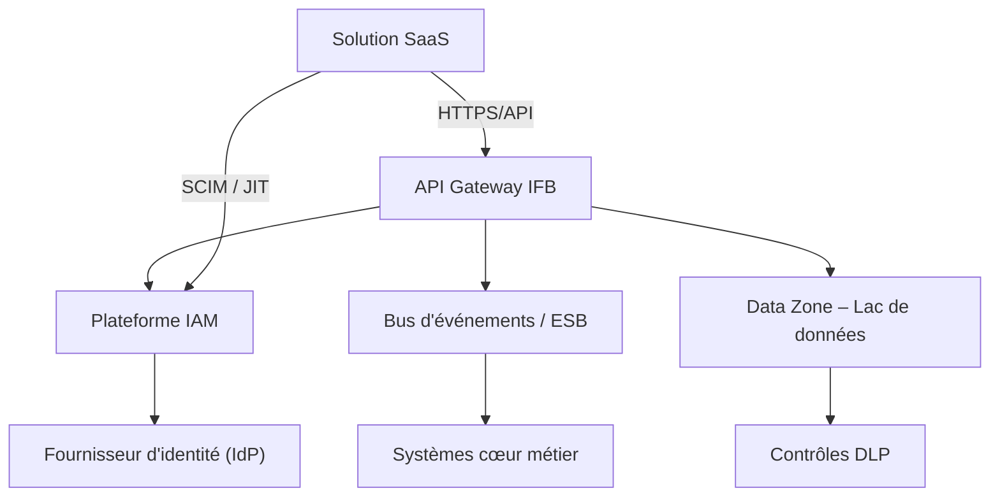

# Principes d'architecture – Intégration des solutions SaaS

---

**Métadonnées**

| Champ         | Valeur                                                                 |
|---------------|------------------------------------------------------------------------|
| Titre         | Principes d'architecture – Intégration des solutions SaaS              |
| ID            | ARCH-PRINC-001                                                         |
| Version       | 1.4                                                                    |
| Statut        | Approuvé                                                               |
| Auteur        | Architecte d'entreprise – Capacités numériques                         |
| Date          | 2025-03-12                                                             |
| Documents liés | 02-exigences-securite-saas.md, 06-patterns-integration-saas.md, 07-patterns-identite-saas.md |

---

## 1. Objectif

Ce document établit les principes directeurs régissant l'intégration des solutions logicielles en mode service (SaaS) au sein de l'écosystème technologique de l'Institution Financière Boréale (IFB). Il s'adresse aux architectes de solutions, aux équipes de livraison et aux comités de gouvernance impliqués dans l'évaluation et l'adoption de plateformes externes.

Ces principes ont été élaborés en réponse à la prolifération non coordonnée de solutions SaaS observée entre 2022 et 2024, qui a engendré des risques de sécurité, des duplications fonctionnelles et des défis d'exploitation non anticipés.

---

## 2. Portée

Ces principes s'appliquent à toute solution SaaS :
- évaluée en vue d'une adoption à IFB
- en cours d'intégration dans les systèmes internes
- en opération et soumise à une revue de conformité

Ils couvrent les dimensions suivantes : identité et accès, gestion des données, intégration technique, sécurité, et gouvernance.

> **Note :** Les solutions hébergées dans l'infonuagique privée d'IFB (cloud interne) ne sont pas visées par ce document, bien que plusieurs principes puissent s'y appliquer par analogie.

---

## 3. Principes directeurs

### P-01 : Identité centralisée obligatoire

Toute solution SaaS doit s'intégrer au fournisseur d'identité centralisé d'IFB (IDP) via SAML 2.0 ou OIDC. L'authentification locale au niveau de la solution est interdite pour les comptes humains, sauf exception documentée et approuvée par le comité de sécurité.

*Référence : 07-patterns-identite-saas.md, section 2.1*

### P-02 : Aucun stockage de secrets dans les systèmes sources

Les secrets (clés API, certificats, mots de passe de comptes techniques) doivent être gérés exclusivement via le coffre de secrets centralisé d'IFB. Les systèmes SaaS ne doivent pas maintenir leurs propres magasins de secrets exposés aux équipes applicatives.

### P-03 : Traçabilité de bout en bout

Chaque flux d'intégration doit émettre des traces exploitables par la plateforme de journalisation centralisée d'IFB (SIEM). Les événements d'authentification, d'autorisation et d'accès aux données sensibles sont obligatoires.

### P-04 : Souveraineté des données par défaut

Les données classifiées C3 ou C4 (voir 09-donnees-classification-retention-saas.md) ne doivent pas quitter le territoire canadien sans approbation explicite du Bureau de la Protection des Données (BPD). La résidence des données doit être confirmée contractuellement avant la mise en production.

> ⚠️ **Incohérence connue :** Le document 04-architecture-solution-saas-crm.md décrit un flux où des données de profil client sont temporairement traitées dans une région américaine pour des raisons de latence. Ce point est en cours de résolution avec le fournisseur. TBD – en attente du comité d'architecture (réunion prévue T2 2025).

### P-05 : API Gateway comme point d'entrée unique

Toute communication entrante ou sortante entre une solution SaaS et les systèmes internes d'IFB doit transiter par la passerelle API centrale. Les connexions directes de type "backend-to-backend" sans médiation sont interdites.

*Référence : 06-patterns-integration-saas.md, Pattern P-INT-002*

### P-06 : Minimisation des données partagées

Le périmètre des données transmises à un SaaS doit être réduit au strict nécessaire pour la fonction d'affaires visée. Les extractions larges de données ("bulk exports") doivent être justifiées et approuvées.

### P-07 : Résilience et indépendance opérationnelle

Les intégrations ne doivent pas créer de couplage fort susceptible d'interrompre les opérations critiques d'IFB en cas d'indisponibilité du SaaS. Des mécanismes de dégradation gracieuse (circuit breaker, cache local, mode hors-ligne) doivent être prévus pour les flux à criticité élevée.

---

## 4. Intégration cible

L'architecture cible d'intégration SaaS d'IFB repose sur les composantes suivantes :

> **Note :** Le rôle exact de l'ESB dans cette architecture est encore en discussion. Certains flux passent directement par l'API Gateway. Une rationalisation est prévue dans le cadre du programme d'architecture d'intégration 2025-2026.

---

## 5. Identité et accès

- Protocoles supportés : SAML 2.0 (préféré), OIDC (accepté pour les SaaS modernes)
- Provisioning : SCIM v2 est la cible; le provisioning JIT est accepté comme mesure transitoire uniquement
- MFA : obligatoire pour tous les accès humains à des données C3/C4
- Comptes techniques : doivent être enregistrés dans le registre des identités non-humaines (RINH)

*Référence : 07-patterns-identite-saas.md*

---

## 6. Gestion des données

- Toute donnée échangée avec un SaaS doit être classifiée avant la mise en production
- Les flux de données doivent être documentés dans le registre des flux de données sensibles (RFDS)
- La rétention des données dans les systèmes SaaS doit être alignée avec la politique de rétention IFB
- Le chiffrement en transit (TLS 1.2 minimum, TLS 1.3 préféré) et au repos est obligatoire

---

## 7. Exigences non fonctionnelles

| Dimension       | Exigence minimale                              |
|-----------------|------------------------------------------------|
| Disponibilité   | 99,5% pour les SaaS de criticité standard      |
| Performance     | Temps de réponse API < 2s au 95e percentile    |
| Sécurité        | Conformité SOC 2 Type II ou équivalent         |
| Conformité      | PIPEDA, Loi 25 (Québec)                        |
| Résilience      | RTO < 4h, RPO < 1h pour criticité haute        |

---

## 8. Points de contrôle architecture

Avant toute mise en production d'une solution SaaS, les jalons suivants doivent être franchis :

1. **Évaluation initiale (Gate 1)** : validation du modèle d'identité et de la conformité réseau
2. **Revue de sécurité (Gate 2)** : validation par l'équipe de cybersécurité IFB
3. **Validation des données (Gate 3)** : confirmation de la résidence et de la classification
4. **Approbation architecture (Gate 4)** : signature de l'architecte d'entreprise responsable

> Les critères précis de chaque Gate sont définis dans le processus d'approbation SaaS (PAG-SaaS-2024). Ce document est en cours de révision.

---

## 9. Hypothèses et risques

**Hypothèses :**
- IFB maintient un IDP centralisé opérationnel et capable de supporter les protocoles décrits
- La passerelle API est disponible et dimensionnée pour absorber les flux SaaS additionnels
- Les équipes SaaS des fournisseurs collaborent pour implémenter les intégrations standards

**Risques :**
- Certains SaaS du marché ne supportent pas SCIM v2 nativement, ce qui peut forcer un recours prolongé au JIT
- La prolifération d'exceptions peut affaiblir les contrôles si les processus d'approbation sont insuffisamment rigoureux
- La résidence des données peut être difficile à vérifier contractuellement avec certains fournisseurs émergents

---

*Document maintenu par l'équipe Architecture d'Entreprise – Domaine Numérique, IFB.*
