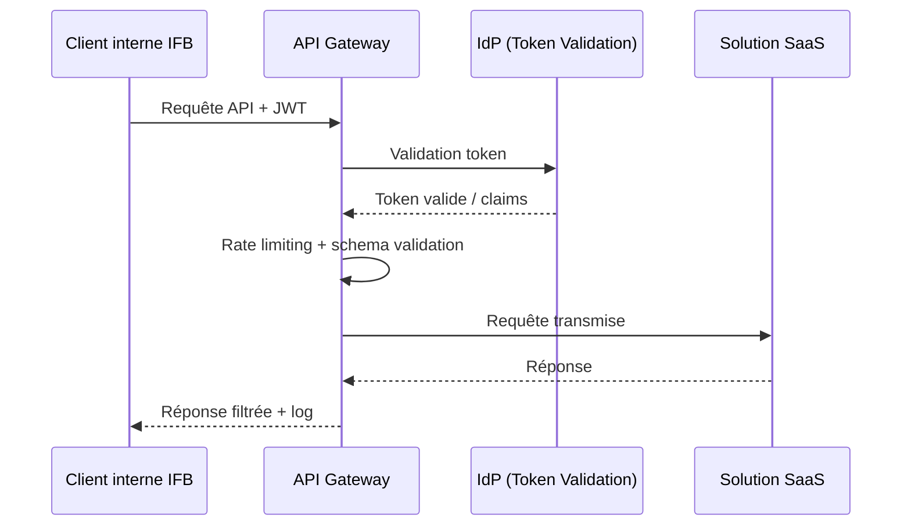

# Exigences de sécurité – Solutions SaaS

---

**Métadonnées**

| Champ         | Valeur                                                                  |
|---------------|-------------------------------------------------------------------------|
| Titre         | Exigences de sécurité – Solutions SaaS                                  |
| ID            | SEC-REQ-002                                                             |
| Version       | 2.1                                                                     |
| Statut        | Approuvé – en révision partielle                                        |
| Auteur        | Architecte sécurité – Domaine Infrastructure et Cybersécurité           |
| Date          | 2025-01-28                                                              |
| Documents liés | 01-principes-architecture-integration-saas.md, 07-patterns-identite-saas.md, 09-donnees-classification-retention-saas.md |

---

## 1. Objectif

Ce document définit les exigences de sécurité minimales applicables à toute solution SaaS adoptée par l'Institution Financière Boréale (IFB). Il complète le document de principes (ARCH-PRINC-001) en apportant des précisions opérationnelles sur les contrôles attendus, les responsabilités partagées et les exceptions admissibles.

> **Note :** Ce document est en cours de révision pour intégrer les nouvelles exigences du cadre réglementaire provincial sur la protection des renseignements personnels (en vigueur depuis septembre 2023). Les sections 4 et 7 sont les plus affectées.

---

## 2. Authentification et fédération

### 2.1 Protocoles requis

| Cas d'usage                        | Protocole requis        | Protocole accepté (transitoire) |
|------------------------------------|-------------------------|---------------------------------|
| Authentification utilisateurs IFB  | SAML 2.0                | OIDC                            |
| Authentification partenaires       | OIDC                    | –                               |
| Authentification machine-à-machine | OAuth 2.0 (client creds)| –                               |

### 2.2 Authentification multi-facteurs (MFA)

- Obligatoire pour tous les accès humains aux SaaS traitant des données C3 ou C4
- Recommandé pour les SaaS C2
- La MFA doit être portée par l'IDP central; les MFA propriétaires des SaaS ne sont pas acceptées sauf exception formelle

### 2.3 Session et token

- Durée de vie des tokens : maximum 60 minutes pour les tokens d'accès
- Refresh tokens : autorisés uniquement pour les applications interactives avec consentement utilisateur explicite
- La révocation de session doit être propagée depuis l'IDP vers les SaaS dans un délai maximum de 15 minutes

> **Exception connue :** Le SaaS de gestion des ressources humaines (cf. 03-architecture-solution-saas-rh.md) ne supporte pas la révocation de session SAML. Un workaround basé sur des tokens à courte durée de vie est en place. Ce point sera résolu lors de la prochaine mise à jour majeure du fournisseur (date non confirmée).

---

## 3. Autorisation

- Les rôles et permissions dans les SaaS doivent être mappés aux groupes d'identité IFB
- Le principe du moindre privilège s'applique; les rôles "super administrateur" doivent être nominatifs et révisés trimestriellement
- Les accès privilégiés (admin SaaS) doivent passer par la solution PAM d'IFB
- La matrice des droits d'accès doit être documentée dans la fiche de solution SaaS correspondante

---

## 4. Gestion des secrets

- Tout secret utilisé pour des intégrations SaaS (clés API, certificats, identifiants OAuth) doit être stocké dans le coffre de secrets central d'IFB (CoffreVault)
- Rotation obligatoire : clés API tous les 90 jours, certificats avant expiration (alerte à 30 jours)
- Les secrets ne doivent jamais apparaître dans les journaux, les fichiers de configuration en clair, ni dans les dépôts de code source
- Les comptes techniques SaaS doivent être enregistrés dans le Registre des Identités Non-Humaines (RINH)

> TBD – en attente du comité d'architecture : la politique de rotation automatique des secrets pour les SaaS qui ne supportent pas les webhooks de renouvellement n'est pas encore finalisée.

---

## 5. Protection des API

- Toute API exposée par ou vers un SaaS doit transiter par l'API Gateway IFB
- Contrôles obligatoires au niveau de la passerelle :
  - Authentification (OAuth 2.0 / JWT)
  - Limitation de débit (rate limiting)
  - Validation des schémas de requête (input validation)
  - Journalisation des accès
- Les API exposant des données C3/C4 doivent faire l'objet d'une revue de sécurité spécifique
- OWASP API Security Top 10 doit être adressé lors de l'évaluation de chaque SaaS

---

## 6. Exigences réseau

- Les SaaS doivent communiquer avec IFB via des canaux chiffrés (TLS 1.2 minimum, TLS 1.3 préféré)
- Les flux entrants provenant de SaaS (webhooks, callbacks) doivent arriver sur des points d'entrée dédiés et filtrés par le pare-feu applicatif (WAF)
- Les plages d'adresses IP des SaaS doivent être déclarées et enregistrées pour permettre le filtrage en sortie
- Les SaaS ne doivent pas initier de connexions directes vers les réseaux internes d'IFB (DMZ uniquement)

> **Note :** Certains SaaS de type "fraude et AML" (cf. 05-architecture-solution-saas-fraude.md) nécessitent des flux quasi temps réel, ce qui a conduit à des exceptions sur les règles de filtrage réseau. Ces exceptions sont documentées dans le registre des dérogations (RD-2024-047).

---

## 7. Journalisation et audit

Les événements suivants doivent être capturés et transmis au SIEM d'IFB dans un délai de 5 minutes :

| Catégorie                    | Événements obligatoires                              |
|------------------------------|------------------------------------------------------|
| Authentification             | Succès, échec, verrouillage de compte                |
| Autorisation                 | Accès refusé, élévation de privilèges                |
| Données                      | Consultation/export de données C3/C4                 |
| Administration               | Création/modification/suppression de comptes         |
| Intégration                  | Erreurs API, timeouts, rejets de schéma              |

- Conservation des journaux : minimum 12 mois en ligne, 7 ans en archive
- Format requis : JSON structuré (CEF accepté pour les SaaS legacy)

---

## 8. Classification des données et responsabilités

### Matrice de responsabilité (RACI simplifié)

| Activité                        | IFB (Sécurité) | Équipe SaaS IFB | Fournisseur |
|---------------------------------|----------------|-----------------|-------------|
| Classification des données      | A              | R               | C           |
| Chiffrement au repos            | A              | C               | R           |
| Contrôles d'accès logiques      | A              | R               | C           |
| Journalisation des événements   | A              | R               | R           |
| Tests d'intrusion               | A              | C               | I           |
| Notification d'incident         | A              | R               | R           |

---

## 9. Exceptions fréquentes et processus d'approbation

Les exceptions les plus fréquemment demandées et leur traitement :

| Exception                              | Fréquence | Processus d'approbation              |
|----------------------------------------|-----------|--------------------------------------|
| MFA locale du SaaS                     | Élevée    | Comité sécurité + RSSI               |
| Pas de support SCIM                    | Élevée    | Comité architecture                  |
| Résidence des données hors Canada      | Moyenne   | BPD + RSSI + Direction juridique     |
| Token lifetime > 60 min               | Faible    | Comité sécurité                      |
| Connexion directe sans API Gateway     | Faible    | RSSI + Architecte principal          |

> **Observation :** Le volume d'exceptions traitées en 2024 a augmenté de 40% par rapport à 2023, ce qui suggère que certains principes sont peut-être trop contraignants pour l'écosystème SaaS actuel. Une révision des seuils est envisagée pour 2025 mais n'est pas encore planifiée formellement.

---

## 10. Risques et hypothèses

**Risques :**
- Un SaaS non conforme mis en production par une équipe métier sans passage par les gates peut créer une exposition non détectée
- La rotation manuelle des secrets reste un vecteur d'erreur humaine élevé
- Les fournisseurs SaaS peuvent modifier leurs pratiques de journalisation sans préavis, créant des lacunes d'audit

**Hypothèses :**
- Le SIEM d'IFB est capable d'ingérer les formats de logs des principaux SaaS utilisés
- Les équipes SaaS des fournisseurs ont une compréhension suffisante des exigences de sécurité pour implémenter les contrôles requis

---

*Document maintenu par l'équipe Cybersécurité – Architecture et Standards, IFB.*
