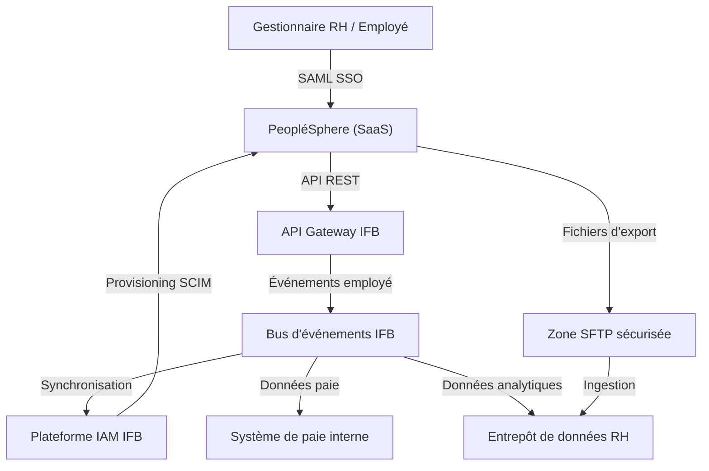
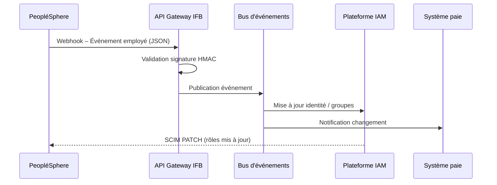

# Architecture de solution – SaaS Gestion des Ressources Humaines (GRH)

---

**Métadonnées**

| Champ         | Valeur                                                                      |
|---------------|-----------------------------------------------------------------------------|
| Titre         | Architecture de solution – SaaS GRH (PeopléSphere)                         |
| ID            | SOL-RH-003                                                                  |
| Version       | 1.2                                                                         |
| Statut        | Approuvé pour production – revue annuelle prévue T3 2025                    |
| Auteur        | Architecte de solutions – Domaine Ressources Humaines                       |
| Date          | 2024-11-05                                                                  |
| Documents liés | 01-principes-architecture-integration-saas.md, 02-exigences-securite-saas.md, 07-patterns-identite-saas.md, 09-donnees-classification-retention-saas.md |

---

## 1. Contexte d'affaires

L'Institution Financière Boréale (IFB) a sélectionné la plateforme SaaS **PeopléSphere** (nom fictif) comme système de gestion du capital humain (HCM) pour remplacer le système legacy GRHI-2000, en opération depuis 2009. La migration concerne l'ensemble des employés actifs (environ 8 400 personnes) et les sous-traitants réguliers (environ 1 200 personnes).

Les capacités couvertes par PeopléSphere incluent :
- Gestion du dossier employé
- Paie (intégration avec le système de paie interne – traitement conservé en interne)
- Gestion des absences et congés
- Performance et développement
- Recrutement (module optionnel – non activé en phase 1)

---

## 2. Portée de cette architecture

Ce document couvre :
- L'architecture logique de la solution PeopléSphere dans le contexte IFB
- Les flux d'intégration entre PeopléSphere et les systèmes internes
- Le modèle d'identité et de provisioning
- Les flux de données sensibles
- Les risques, hypothèses et écarts de conformité

Hors portée : la migration des données historiques (couverte dans le plan de migration GRH-MIG-2024).

---

## 3. Diagramme de contexte

---

## 4. Architecture logique

PeopléSphere est une solution multi-tenant hébergée dans l'infonuagique publique (région Canada – confirmée contractuellement). IFB dispose d'un tenant dédié avec isolation des données garantie par le contrat de service.

Les composantes internes impliquées :
- **API Gateway IFB** : point d'entrée unique pour les flux API bidirectionnels
- **Bus d'événements** : distribution des événements RH vers les systèmes consommateurs
- **Plateforme IAM** : source de vérité pour les identités employés
- **Système de paie interne** : consommateur des données de temps et présence
- **Entrepôt de données RH** : analytics et reporting

---

## 5. Flux d'intégration

### Flux 1 : Événements de cycle de vie employé (PeopléSphere → IFB)

À chaque événement de cycle de vie (embauche, promotion, départ, changement de rôle), PeopléSphere publie un événement via webhook vers l'API Gateway IFB. L'événement est ensuite distribué par le bus d'événements aux systèmes consommateurs.

### Flux 2 : Export de données analytiques (quotidien)

Un export fichier quotidien (CSV chiffré) est déposé par PeopléSphere sur la zone SFTP sécurisée d'IFB. Ce fichier est ingéré par le pipeline ETL vers l'entrepôt de données RH.

> **Note :** Ce flux par fichier est une solution temporaire. La cible est une intégration API en temps quasi réel. Migration prévue en phase 2 (date non confirmée).

---

## 6. Modèle d'identité

| Aspect                  | Configuration                                        |
|-------------------------|------------------------------------------------------|
| Protocole SSO           | SAML 2.0                                             |
| Provisioning            | SCIM v2 (bidirectionnel partiel)                     |
| Déprovisionning         | SCIM DELETE déclenché par IAM à la désactivation     |
| MFA                     | Portée par IDP central (obligatoire)                 |
| Comptes techniques      | 3 comptes de service enregistrés au RINH             |
| Rôles SaaS              | Mappés aux groupes AD IFB (voir matrice dans annexe) |

**Écart connu :** PeopléSphere ne supporte pas la révocation de session SAML en temps réel. En cas de désactivation d'un compte, la session active peut persister jusqu'à expiration du token (60 min). Ce risque est mitigé par la durée de vie courte des tokens.

*Référence : 02-exigences-securite-saas.md, section 2.3 – Exception documentée*

---

## 7. Flux de données sensibles

| Données                              | Classification | Direction         | Contrôles                        |
|--------------------------------------|----------------|-------------------|----------------------------------|
| Dossier employé (NAS, adresse, etc.) | C3             | IFB → PS          | Chiffrement TLS 1.3, SCIM        |
| Données salariales                   | C4             | PS → Paie (interne)| Chiffrement bout-en-bout        |
| Données de performance               | C2             | Bidirectionnel    | TLS 1.2+                         |
| Données d'accès / logs RH            | C2             | PS → SIEM         | Format JSON, transmission HTTPS  |

> **Note sur la résidence des données :** La région hébergée est Canada (confirmée). Toutefois, le support de niveau 3 du fournisseur (PeopléSphere) peut accéder aux données de configuration depuis des sites hors Canada à des fins de maintenance. Ce point a été soulevé avec le BPD et est en cours d'analyse. TBD – en attente du comité d'architecture.

---

## 8. Alignement aux normes IFB

| Principe / Exigence              | Statut         | Commentaire                                          |
|----------------------------------|----------------|------------------------------------------------------|
| P-01 : Identité centralisée      | Conforme       | SAML 2.0 via IDP central                             |
| P-02 : Gestion secrets           | Conforme       | 3 secrets dans CoffreVault                           |
| P-03 : Traçabilité               | Partiel        | Logs d'authentification OK; logs applicatifs incomplets |
| P-04 : Souveraineté données      | Partiel        | Voir note accès support hors Canada                  |
| P-05 : API Gateway               | Conforme       | Tous les flux passent par la passerelle               |
| SEC-REQ-002 : MFA                | Conforme       | MFA IDP central                                      |
| SEC-REQ-002 : Révocation session | Non conforme   | Exception documentée (voir section 6)                |

---

## 9. Risques

| ID     | Description                                              | Probabilité | Impact  | Mitigation                                 |
|--------|----------------------------------------------------------|-------------|---------|---------------------------------------------|
| R-001  | Accès support fournisseur hors Canada aux données C3     | Moyenne     | Élevé   | Analyse BPD en cours; clauses contractuelles|
| R-002  | Persistance de session après désactivation de compte     | Faible      | Moyen   | Tokens 60 min; surveillance SIEM           |
| R-003  | Rupture du flux webhook (PeopléSphere indisponible)      | Faible      | Élevé   | File d'attente avec retry; alerting         |
| R-004  | Écart entre données paie PS et système interne           | Faible      | Élevé   | Réconciliation quotidienne automatisée      |

---

## 10. Hypothèses

- La région d'hébergement Canada est maintenue pour toute la durée du contrat (5 ans)
- Le fournisseur PeopléSphere maintient le support SCIM v2 dans ses prochaines versions
- L'équipe IAM d'IFB est disponible pour la maintenance des mappings de rôles
- Les volumes de données ne dépasseront pas les limites du plan contractuel SaaS (à valider annuellement)

---

*Document maintenu par l'équipe Architecture de solutions – Domaine Talent et Ressources Humaines, IFB.*
