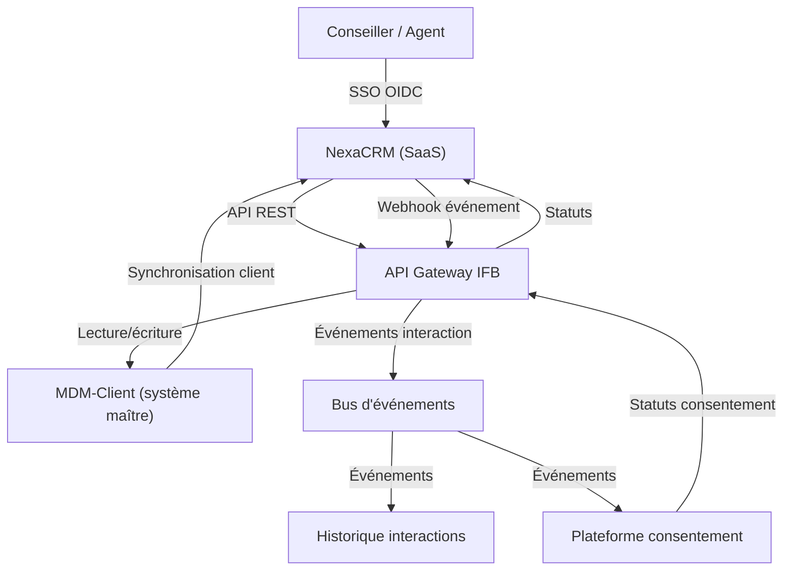
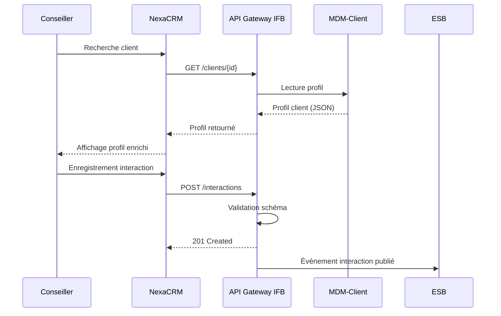

# Architecture de solution – SaaS Gestion de la Relation Client (CRM)

---

**Métadonnées**

| Champ         | Valeur                                                                  |
|---------------|-------------------------------------------------------------------------|
| Titre         | Architecture de solution – SaaS CRM (NexaCRM)                          |
| ID            | SOL-CRM-004                                                             |
| Version       | 0.9 (brouillon avancé)                                                  |
| Statut        | En révision – approbation architecture pendante                         |
| Auteur        | Architecte de solutions – Domaine Distribution et Expérience Client     |
| Date          | 2025-02-14                                                              |
| Documents liés | 01-principes-architecture-integration-saas.md, 02-exigences-securite-saas.md, 06-patterns-integration-saas.md, 09-donnees-classification-retention-saas.md |

---

## 1. Contexte d'affaires

L'IFB déploie la plateforme CRM **NexaCRM** (nom fictif) pour consolider la gestion des interactions clients dans les réseaux de distribution (succursales, centre de contact, conseillers en ligne). L'objectif est de remplacer trois outils disparates actuellement utilisés par les équipes ventes, service et marketing.

NexaCRM sera le système d'enregistrement des interactions client pour :
- Conseillers en succursale (~2 100 utilisateurs)
- Agents du centre de contact (~850 agents)
- Équipe marketing (campagnes et segmentation, ~120 utilisateurs)

---

## 2. Portée

Cette architecture couvre la phase 1 du déploiement :
- Intégration avec le système client maître (MDM-Client)
- Gestion des consentements de communication
- Synchronisation des interactions
- Intégration API pour les flux d'événements

La phase 2 (intégration avec la plateforme d'analytique client et le module campagnes avancées) n'est pas couverte dans ce document.

---

## 3. Architecture logique et diagramme de contexte

---

## 4. Synchronisation client

Le profil client dans NexaCRM est une copie de lecture en provenance du MDM-Client (système de gestion des données maîtresses client d'IFB). La synchronisation fonctionne selon deux modes :

**Mode temps quasi-réel :** événements de changement publiés par MDM-Client via le bus d'événements; NexaCRM s'abonne via webhook.

**Mode réconciliation :** export différentiel quotidien pour corriger les écarts éventuels (en cas de perte d'événements).

> **Risque connu :** Le volume de webhooks en cas de campagne marketing de masse (>50 000 mises à jour clients en 30 minutes) peut dépasser la capacité de traitement du webhook receiver de NexaCRM. Ce scénario n'a pas encore été testé en charge. Un test de performance est prévu avant la mise en production.

---

## 5. Gestion du consentement

Le consentement client pour les communications marketing est géré par la **Plateforme de consentement IFB** (PCI), source de vérité. NexaCRM reçoit les statuts de consentement et les applique pour filtrer les actions de communication autorisées.

Flux :
1. Client modifie son consentement (application mobile IFB ou succursale)
2. PCI publie un événement de consentement
3. L'événement est acheminé via l'API Gateway vers NexaCRM
4. NexaCRM met à jour le profil client (champ en lecture seule dans CRM)

**Contrainte :** NexaCRM ne doit jamais être modifié pour contourner les statuts de consentement. Des contrôles de détection ont été mis en place dans le SIEM.

---

## 6. Intégration API

Les API exposées par NexaCRM vers IFB (webhooks) sont sécurisées par signature HMAC-SHA256. Les API IFB consommées par NexaCRM utilisent OAuth 2.0 (client credentials).

---

## 7. Résidence des données – Incertitude et risques

> ⚠️ **Point ouvert – en attente de clarification**

Le contrat NexaCRM stipule un hébergement principal en région Canada. Cependant, plusieurs situations créent de l'incertitude :

**Situation 1 :** Le module d'analyse de sentiment (optionnel, non activé en phase 1) traite les transcriptions d'appels dans une région américaine. Ce module ne sera pas activé tant que la conformité n'est pas confirmée.

**Situation 2 :** Les sauvegardes de reprise après sinistre (DRP) sont répliquées dans une région américaine selon la documentation technique du fournisseur. Le contrat stipule "région Amérique du Nord" sans précision. Ce point est en négociation avec le fournisseur.

**Situation 3 :** Les logs d'utilisation de la plateforme (télémétrie du SaaS) sont agrégés dans un data lake du fournisseur dont la localisation n'a pas été divulguée.

Ces trois situations ont été transmises au Bureau de la Protection des Données (BPD). Une réponse formelle est attendue. TBD – en attente du comité d'architecture (comité de sécurité et conformité, séance prévue avril 2025).

*Voir également : 01-principes-architecture-integration-saas.md, Principe P-04*

---

## 8. Modèle d'identité

| Aspect                  | Configuration                                             |
|-------------------------|-----------------------------------------------------------|
| Protocole SSO           | OIDC (SAML non supporté par NexaCRM en version actuelle)  |
| Provisioning            | JIT (SCIM non disponible – planifié pour v3.2 du produit) |
| Déprovisionning         | Manuel (processus RH déclenche la désactivation via ticket)|
| MFA                     | IDP central                                               |
| Rôles                   | 4 rôles standards mappés aux groupes AD                   |

**Écart :** Le provisioning JIT est utilisé comme solution transitoire. SCIM v2 est la cible selon les principes IFB (cf. 01-principes-architecture-integration-saas.md, P-01). La mise en œuvre de SCIM est dépendante de la roadmap fournisseur (version 3.2, date estimée T4 2025 – non garantie).

**Risque de déprovisionning :** Le déprovisionning manuel crée un risque de comptes orphelins. Un script de réconciliation hebdomadaire compare les comptes NexaCRM actifs avec l'annuaire IFB et génère une alerte pour les écarts.

---

## 9. Données sensibles échangées

| Données                           | Classification | Justification de l'échange               |
|-----------------------------------|----------------|------------------------------------------|
| Nom, prénom, adresse client       | C3             | Affichage profil conseiller              |
| NAS client                        | C4             | Non transmis à NexaCRM (hors portée)     |
| Numéro de compte (partiel)        | C3             | Référence pour l'interaction uniquement  |
| Historique des interactions       | C2             | Continuité du service                    |
| Statut consentement               | C2             | Contrôle légal des communications        |
| Enregistrements d'appels          | C3             | Non transmis en phase 1                  |

---

## 10. Risques et hypothèses

**Risques :**
- Incertitude sur la résidence des données de sauvegarde (en cours de résolution)
- Déprovisionning manuel : risque d'accès résiduel
- Performance des webhooks sous charge élevée non testée
- SCIM non disponible : déviation aux principes IFB acceptable à court terme seulement

**Hypothèses :**
- Le fournisseur livrera SCIM v2 en T4 2025 comme annoncé
- La région d'hébergement principale Canada est et restera valide
- Le volume de transactions API restera dans les limites du plan contractuel (5M appels/mois)

---

*Document maintenu par l'équipe Architecture de solutions – Domaine Expérience Client, IFB.*
