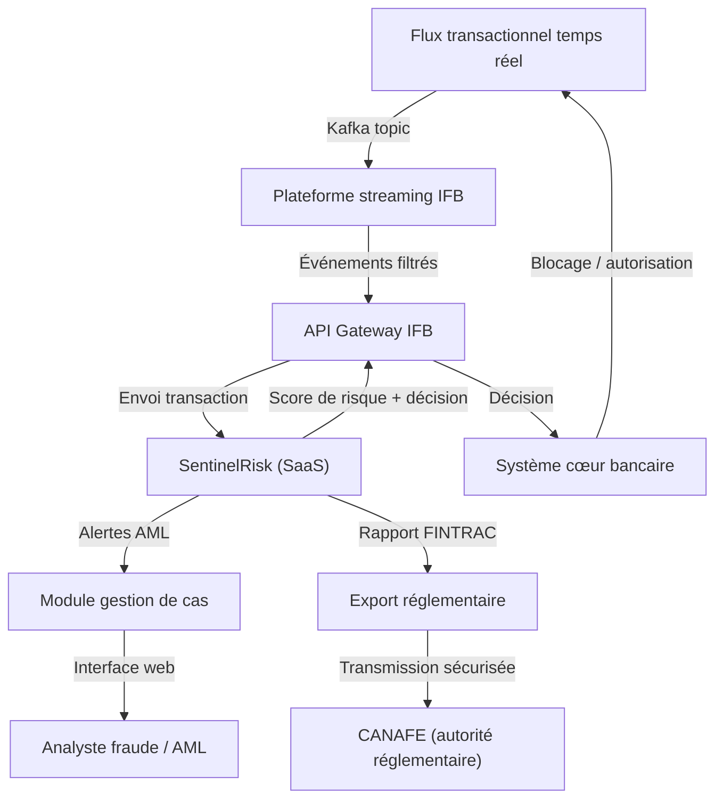
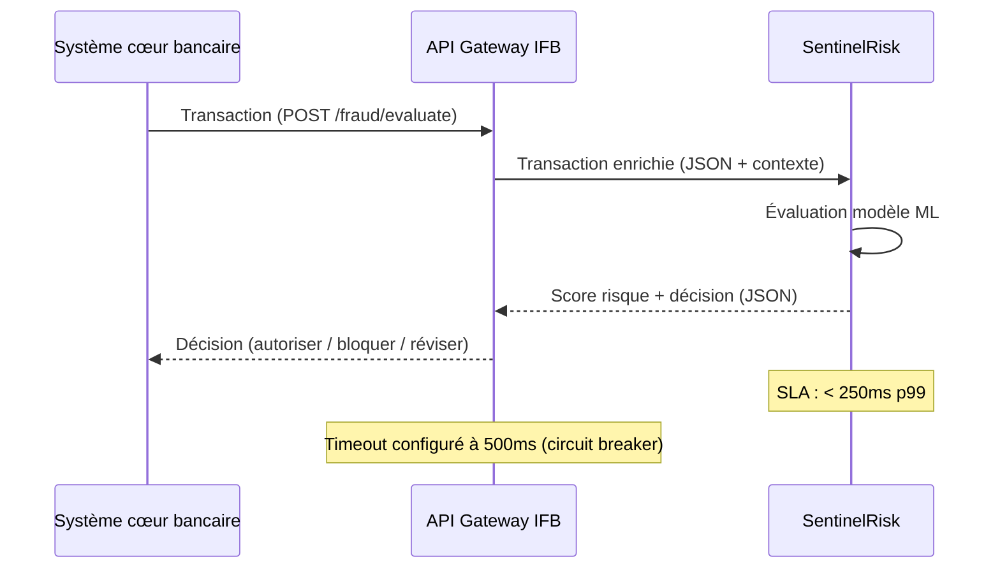

# Architecture de solution – SaaS Détection de fraude et conformité AML

---

**Métadonnées**

| Champ         | Valeur                                                                       |
|---------------|------------------------------------------------------------------------------|
| Titre         | Architecture de solution – SaaS Fraude/AML (SentinelRisk)                   |
| ID            | SOL-FRAUD-005                                                                |
| Version       | 2.0                                                                          |
| Statut        | Approuvé – classé critique (Tier 1)                                          |
| Auteur        | Architecte principal – Domaine Risque et Conformité                          |
| Date          | 2024-09-30                                                                   |
| Documents liés | 01-principes-architecture-integration-saas.md, 02-exigences-securite-saas.md, 08-exploitabilite-operations-saas.md, 09-donnees-classification-retention-saas.md |

---

## 1. Contexte d'affaires

La plateforme **SentinelRisk** (nom fictif) est la solution SaaS de détection de fraude transactionnelle et de surveillance AML (Anti-Money Laundering) de l'IFB. Elle analyse en temps quasi-réel les transactions initiées via les canaux numériques et les guichets, et supporte les processus d'investigation des analystes de conformité.

Cette solution est classifiée **Tier 1 – Critique** en raison de son rôle dans la conformité réglementaire (CANAFE, FINTRAC) et son impact direct sur la continuité des opérations bancaires.

Utilisateurs principaux :
- Analystes fraude (~45 personnes)
- Analystes AML/conformité (~30 personnes)
- Administrateurs de la plateforme (~5 personnes)

---

## 2. Portée

Ce document couvre :
- L'architecture des flux de détection en temps quasi-réel
- L'architecture des flux d'investigation et de gestion de cas
- Le modèle d'identité et les accès privilégiés
- La haute disponibilité et la résilience
- La conservation des preuves et des données d'investigation
- Les risques et écarts de conformité

---

## 3. Architecture de détection – vue globale

---

## 4. Flux de détection temps quasi-réel

La détection opère avec une contrainte de latence maximale de **250ms** entre la réception de la transaction et le retour de la décision. Ce SLA est contractuellement garanti par SentinelRisk.

En cas de dépassement du timeout, le circuit breaker de l'API Gateway déclenche une décision par défaut (configurable : autoriser ou bloquer selon le type de transaction). La politique de défaut est définie dans la matrice de risque opérationnel.

---

## 5. Haute disponibilité

SentinelRisk est déployé en configuration multi-zone avec failover automatique. Les exigences IFB pour cette solution :

| Dimension     | Exigence          | Fournie par SentinelRisk  |
|---------------|-------------------|---------------------------|
| Disponibilité | 99,95%            | 99,95% (SLA contractuel)  |
| RTO           | < 15 minutes      | < 10 minutes (garanti)    |
| RPO           | < 5 minutes       | < 2 minutes               |
| Latence       | < 250ms (p99)     | < 200ms (p99 observé)     |

> **Note :** L'exigence de 99,95% dépasse le seuil standard IFB de 99,5% défini dans ARCH-PRINC-001. Ce seuil plus élevé a été approuvé spécifiquement pour les solutions Tier 1 par le comité d'architecture (séance 2023-Q3).

---

## 6. Gestion des analystes et accès privilégiés

Les analystes fraude et AML accèdent à des données hautement sensibles (transactions, profils clients, rapports d'enquête). Le modèle d'accès est renforcé :

| Aspect                   | Configuration                                                    |
|--------------------------|------------------------------------------------------------------|
| SSO                      | SAML 2.0 via IDP central                                         |
| Provisioning             | SCIM v2 (bidirectionnel complet)                                 |
| MFA                      | Obligatoire (FIDO2 préféré, TOTP accepté)                        |
| Accès admin plateforme   | Via PAM IFB (session enregistrée)                                |
| Accès aux cas            | Basé sur les rôles + segmentation par équipe                     |
| Audit d'accès            | Révision mensuelle obligatoire par le responsable conformité     |

SentinelRisk est la seule solution SaaS IFB à avoir implémenté SCIM v2 en production complète. Ce cas est référencé comme exemple de bonne pratique dans les autres documents de solution.

*Référence : 07-patterns-identite-saas.md, section 3 – Pattern SCIM complet*

---

## 7. Conservation des preuves

Les données d'investigation AML (dossiers de cas, documents, décisions) sont soumises à des exigences de conservation réglementaire strictes :

- Conservation minimale : **7 ans** à compter de la clôture du cas
- Intégrité : les enregistrements ne doivent pas pouvoir être modifiés après clôture (WORM)
- Accès limité : seuls les responsables conformité et la direction peuvent accéder aux cas archivés
- Export réglementaire : format FINTRAC prescrit, transmission chiffrée

La conservation long terme est assurée par une archive froide dans l'infonuagique IFB (région Canada), alimentée par une exportation mensuelle depuis SentinelRisk.

*Référence : 09-donnees-classification-retention-saas.md, section 4 – Conservation réglementaire*

---

## 8. Exigences réseau spécifiques

> **Exception réseau documentée (RD-2024-047) :**

En raison de la contrainte de latence de 250ms, SentinelRisk utilise une connexion dédiée (lien privé / peering) plutôt que le chemin standard via l'API Gateway IFB pour les flux transactionnels en temps réel. L'API Gateway est maintenu pour les flux de gestion de cas et d'administration.

Cette exception a été approuvée par le RSSI et l'architecte principal. Elle est documentée avec une revue annuelle obligatoire.

---

## 9. Résidence des données

La résidence des données de SentinelRisk a été vérifiée et confirmée :
- Données transactionnelles et de cas : région Canada (confirmé contractuellement)
- Modèles ML : entraînement dans une infrastructure partagée du fournisseur (localisation : non divulguée)
- Données d'entraînement soumises à SentinelRisk : anonymisées et agrégées (aucune donnée client identifiable)

> **Point en analyse :** L'utilisation de données transactionnelles historiques (anonymisées) pour améliorer les modèles ML du fournisseur est autorisée selon le contrat, mais sa conformité avec la Loi 25 n'a pas encore été formellement évaluée. TBD – en attente du comité d'architecture et du BPD.

---

## 10. Opérations et escalade

*Référence : 08-exploitabilite-operations-saas.md*

Les modalités d'escalade spécifiques à SentinelRisk (solution Tier 1) :
- Astreinte fournisseur 24/7 avec engagement de réponse < 30 minutes pour incidents critiques
- Représentant technique dédié IFB (point de contact nommé)
- Bridge d'incident commun IFB + fournisseur pour les incidents de niveau P1
- Bilan mensuel de performance avec le TAM (Technical Account Manager) du fournisseur

---

## 11. Risques

| ID     | Description                                                   | Niveau  | Mitigation                                         |
|--------|---------------------------------------------------------------|---------|----------------------------------------------------|
| R-001  | Latence dégradée en cas de congestion réseau                  | Élevé   | Lien dédié, circuit breaker, décision par défaut   |
| R-002  | Modèles ML non explicables (décisions opaques)                | Moyen   | Obligation contractuelle de journaux d'explication |
| R-003  | Conformité Loi 25 pour partage données ML non confirmée       | Moyen   | En analyse BPD; partage suspendu en attendant      |
| R-004  | Dépendance forte : panne SR = blocage des transactions        | Élevé   | Circuit breaker + politique de défaut documentée   |

---

*Document maintenu par l'équipe Architecture – Domaine Risque, Fraude et Conformité réglementaire, IFB.*
