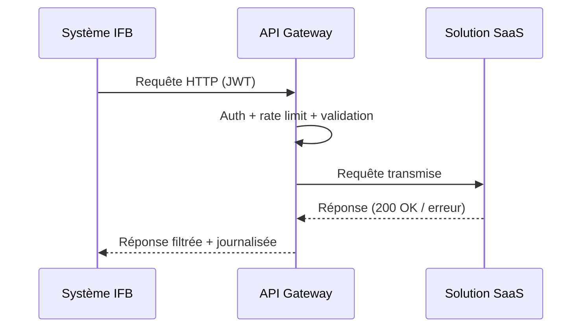
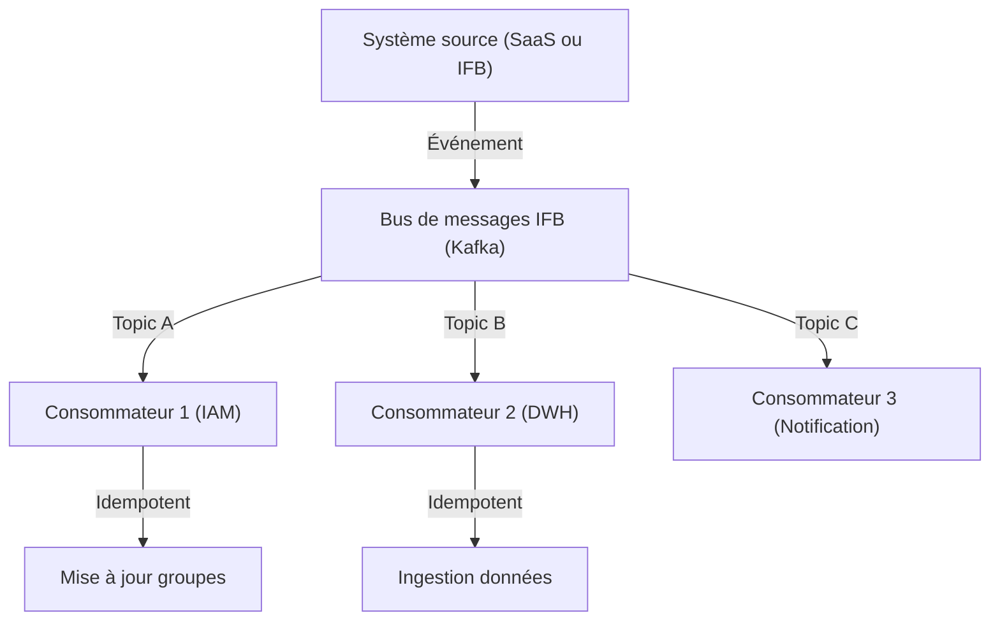
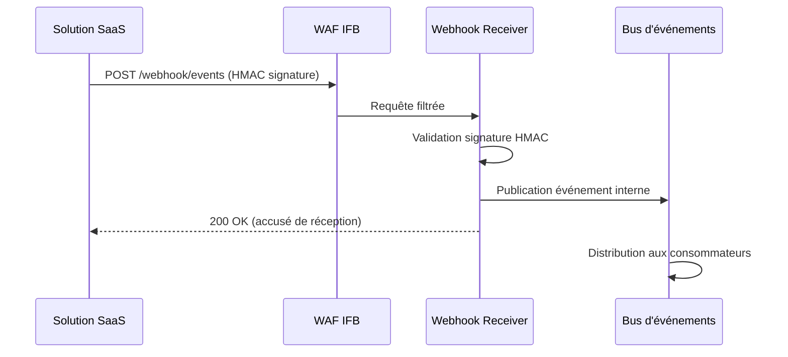

# Patterns d'intégration – Solutions SaaS

---

**Métadonnées**

| Champ         | Valeur                                                                  |
|---------------|-------------------------------------------------------------------------|
| Titre         | Patterns d'intégration – Solutions SaaS                                 |
| ID            | ARCH-INT-006                                                            |
| Version       | 1.1                                                                     |
| Statut        | Approuvé                                                                |
| Auteur        | Architecte d'intégration – Services partagés numériques                 |
| Date          | 2025-01-10                                                              |
| Documents liés | 01-principes-architecture-integration-saas.md, 02-exigences-securite-saas.md, 07-patterns-identite-saas.md |

---

## 1. Objectif

Ce document catalogue les patterns d'intégration approuvés pour les flux entre les solutions SaaS et les systèmes internes de l'Institution Financière Boréale (IFB). Il sert de référence normative pour les équipes d'architecture et de livraison lors de la conception de nouvelles intégrations.

Chaque pattern inclut : contexte d'usage, avantages, limites, risques de sécurité et diagramme Mermaid.

---

## 2. Catalogue des patterns

---

### P-INT-001 : API synchrone via passerelle (API Gateway)

**Contexte d'usage :**
Flux requête-réponse entre un système IFB et un SaaS (ou l'inverse) nécessitant une réponse immédiate. Utilisé pour les opérations de lecture de données, les validations en temps réel, et les actions transactionnelles.

**Exemples d'usage :**
- Lecture du profil client depuis NexaCRM (04-architecture-solution-saas-crm.md)
- Validation fraude en temps quasi-réel (05-architecture-solution-saas-fraude.md)

**Avantages :**
- Simplicité conceptuelle et de débogage
- Latence faible pour les opérations légères
- Contrôles centralisés (auth, rate limiting, logging) à la passerelle

**Limites :**
- Couplage temporel : le système appelant doit attendre la réponse
- Non adapté aux traitements longs (> quelques secondes)
- La disponibilité du SaaS impacte directement l'expérience utilisateur

**Risques de sécurité :**
- Injection via les paramètres de requête (mitigation : validation schéma obligatoire)
- Exposition d'API non sécurisées si la passerelle est contournée

---

### P-INT-002 : Événements asynchrones via bus de messages

**Contexte d'usage :**
Flux unidirectionnel déclenché par un événement métier (ex : création d'un compte, désactivation d'un employé, modification d'un consentement). Aucune réponse immédiate requise.

**Exemples d'usage :**
- Cycle de vie employé depuis PeopléSphere (03-architecture-solution-saas-rh.md)
- Mise à jour des consentements vers NexaCRM (04-architecture-solution-saas-crm.md)

**Avantages :**
- Découplage temporel : émetteur et récepteur n'ont pas besoin d'être disponibles simultanément
- Résilience : les événements sont persistés en cas d'indisponibilité du récepteur
- Scalabilité naturelle

**Limites :**
- Complexité de débogage accrue (traçage distribué nécessaire)
- Garantie de livraison "at-least-once" : les récepteurs doivent être idempotents
- Latence supérieure au pattern synchrone

**Risques de sécurité :**
- Empoisonnement de la file (payload malveillant) : validation obligatoire à la consommation
- Données sensibles dans les événements : chiffrement des payloads C3/C4 requis

---

### P-INT-003 : Échange de fichiers via SFTP sécurisé

**Contexte d'usage :**
Transfert de volumes importants de données en mode batch (ex : exports quotidiens, rapports réglementaires, réconciliation). Utilisé lorsque le SaaS ne supporte pas d'API temps réel ou pour des flux à faible fréquence.

**Exemples d'usage :**
- Export analytique quotidien depuis PeopléSphere (03-architecture-solution-saas-rh.md)
- Export réglementaire FINTRAC depuis SentinelRisk (05-architecture-solution-saas-fraude.md)

**Avantages :**
- Simplicité d'implémentation côté SaaS (supporté universellement)
- Adapté aux grands volumes
- Compatible avec les workflows de traitement batch

**Limites :**
- Latence élevée (données pas temps réel)
- Gestion manuelle des erreurs plus fréquente
- Risque de fichiers partiels ou corrompus

**Risques de sécurité :**
- Authentification SFTP : clés SSH obligatoires (mot de passe interdit)
- Chiffrement des fichiers au niveau applicatif (PGP) pour les données C3/C4
- Zone SFTP isolée et surveillée

> **Note :** Ce pattern est considéré comme transitoire pour les cas où une API temps réel est envisageable à moyen terme. Les équipes sont encouragées à planifier la migration vers P-INT-001 ou P-INT-002 dès que le SaaS le permet.

---

### P-INT-004 : Webhooks entrants (SaaS → IFB)

**Contexte d'usage :**
Le SaaS notifie IFB de manière proactive lors d'un événement (ex : alerte fraude, changement de statut, erreur de traitement). IFB expose un endpoint de réception.

**Exemples d'usage :**
- Alertes fraude depuis SentinelRisk
- Événements de cycle de vie employé depuis PeopléSphere
- Notifications de synchronisation depuis NexaCRM

**Avantages :**
- Réactivité immédiate aux événements SaaS
- Évite le polling coûteux

**Limites :**
- IFB doit exposer un endpoint accessible depuis l'internet (DMZ)
- Gestion des retentatives et des doublons à la charge d'IFB
- Le SaaS doit supporter la configuration de webhooks (pas toujours le cas)

**Risques de sécurité :**
- Validation obligatoire de la signature HMAC ou du token secret fourni par le SaaS
- Rate limiting sur le endpoint récepteur
- Le endpoint doit être protégé par le WAF d'IFB

---

### P-INT-005 : Export analytique vers le lac de données

**Contexte d'usage :**
Le SaaS fournit des données d'utilisation ou métier qui enrichissent le lac de données IFB pour des fins d'analytique, de reporting réglementaire ou de ML interne.

**Exemples d'usage :**
- Données de performance RH depuis PeopléSphere
- Données d'interactions clients depuis NexaCRM

**Avantages :**
- Découplage complet entre le SaaS et les traitements analytiques
- Permet des analyses croisées avec d'autres sources internes

**Limites :**
- Les données doivent être retraitées (nettoyage, déduplication) avant usage
- Latence inhérente (données J-1 au minimum)

**Risques de sécurité :**
- Les données sensibles dans le lac doivent être masquées ou tokenisées selon la politique de classification
- Contrôles d'accès au lac de données alignés avec la classification (voir 09-donnees-classification-retention-saas.md)

---

## 3. Matrice de sélection des patterns

| Critère                      | P-INT-001 | P-INT-002 | P-INT-003 | P-INT-004 | P-INT-005 |
|------------------------------|-----------|-----------|-----------|-----------|-----------|
| Latence faible requise       | ✅        | ❌        | ❌        | ✅        | ❌        |
| Grand volume de données      | ❌        | ⚠️        | ✅        | ❌        | ✅        |
| Découplage temporel          | ❌        | ✅        | ✅        | ❌        | ✅        |
| Réponse requise              | ✅        | ❌        | ❌        | ❌        | ❌        |
| Initié par le SaaS           | ❌        | ⚠️        | ⚠️        | ✅        | ⚠️        |

---

## 4. Hypothèses et points ouverts

**Hypothèses :**
- La plateforme Kafka IFB est dimensionnée pour absorber les volumes cumulés de tous les SaaS en production
- Le composant Webhook Receiver est maintenu comme service partagé par l'équipe des services partagés numériques

**Points ouverts :**
- La coexistence de l'ESB legacy et de Kafka pour certains flux crée des ambiguïtés. Une décision d'architecture sur la convergence est requise. TBD – en attente du comité d'architecture (programme d'intégration 2025).

---

*Document maintenu par l'équipe Architecture d'intégration – Services partagés numériques, IFB.*
