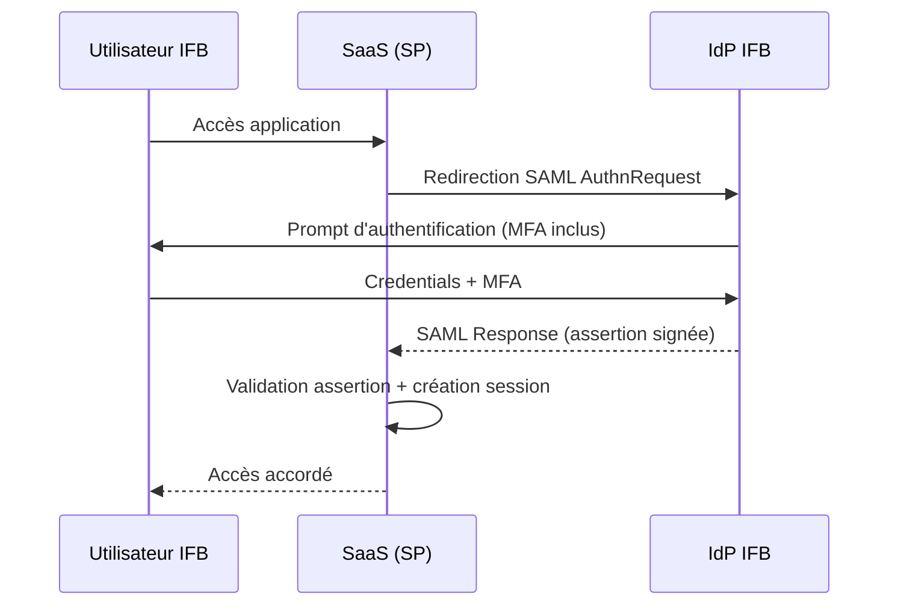
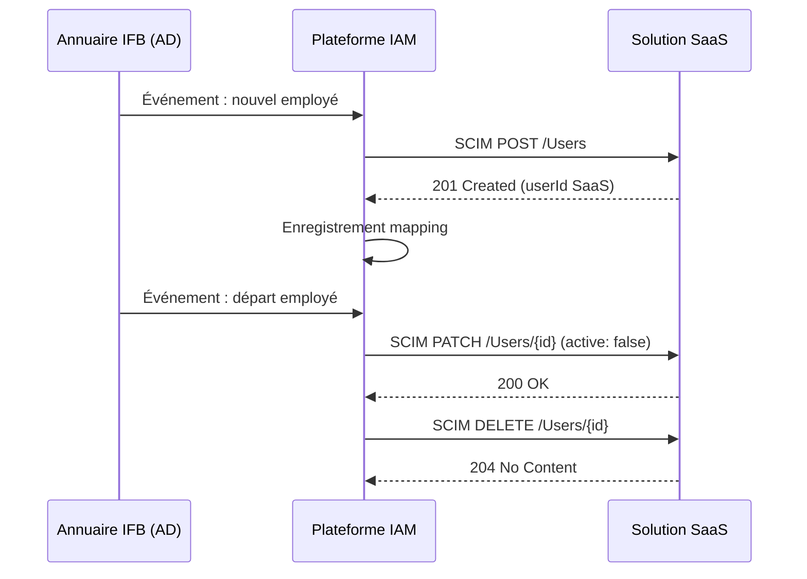
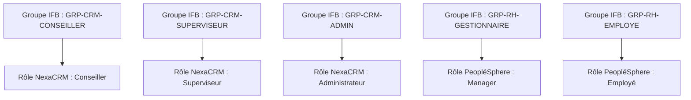

# Patterns d'identité – Solutions SaaS

---

**Métadonnées**

| Champ         | Valeur                                                                     |
|---------------|----------------------------------------------------------------------------|
| Titre         | Patterns d'identité et d'accès – Solutions SaaS                            |
| ID            | ARCH-IAM-007                                                               |
| Version       | 1.3                                                                        |
| Statut        | Approuvé                                                                   |
| Auteur        | Architecte IAM – Capacités d'entreprise                                    |
| Date          | 2025-02-01                                                                 |
| Documents liés | 01-principes-architecture-integration-saas.md, 02-exigences-securite-saas.md, 03-architecture-solution-saas-rh.md, 05-architecture-solution-saas-fraude.md |

---

## 1. Objectif

Ce document définit les patterns approuvés pour la gestion des identités, du provisioning et des accès dans le contexte des solutions SaaS adoptées par l'IFB. Il s'adresse aux équipes d'architecture, à l'équipe IAM centrale et aux équipes de livraison SaaS.

L'objectif est de standardiser les approches pour éviter la prolifération de modèles d'identité incompatibles ou non gouvernés.

---

## 2. Contexte général

L'IFB opère un fournisseur d'identité (IdP) centralisé basé sur une plateforme d'identité d'entreprise. Cet IdP est la source de vérité pour tous les utilisateurs humains (employés et sous-traitants) et gère :
- L'authentification (SAML 2.0, OIDC)
- L'annuaire d'entreprise (LDAP / AD)
- Les groupes et rôles d'entreprise
- La MFA

Le Registre des Identités Non-Humaines (RINH) gère les comptes techniques (comptes de service, robots, intégrations machine-à-machine).

---

## 3. Patterns d'authentification fédérée

### Pattern IAM-P-01 : SAML 2.0 (Standard)

**Usage recommandé :** SaaS enterprise standard, applications critiques.

**Description :** L'utilisateur s'authentifie via l'IDP IFB (Identity Provider). Le SaaS agit comme Service Provider (SP). L'IDP émet une assertion SAML contenant les attributs utilisateur et les groupes de rôles.

**Quand utiliser :**
- SaaS supportant SAML 2.0 nativement
- Applications à usage professionnel standard

**Avantages :**
- Contrôle complet côté IFB
- Révocation centralisée
- Audit des connexions côté IDP

**Limites :**
- Certains SaaS modernes privilégient OIDC
- La révocation de session ne se propage pas toujours en temps réel (limitation connue, cf. 03-architecture-solution-saas-rh.md)

---

### Pattern IAM-P-02 : OIDC (Moderne)

**Usage recommandé :** SaaS natif cloud, API-first, applications mobiles ou à interface moderne.

**Description :** L'IDP IFB joue le rôle d'OpenID Provider. Le SaaS est le Relying Party. Les tokens (ID token, access token) sont émis par l'IDP.

**Quand utiliser :**
- SaaS ne supportant pas SAML
- Applications nécessitant des tokens courts pour des appels API

**Avantages :**
- Plus léger que SAML pour les flux mobiles/API
- Tokens JWT inspectables

**Limites :**
- Support OIDC de certains SaaS peut être partiel ou non standard
- Refresh tokens doivent être gérés avec soin (risque de persistance de session)

> **Note :** NexaCRM (04-architecture-solution-saas-crm.md) utilise OIDC car SAML n'est pas supporté dans la version actuelle. Ce choix est accepté mais non préféré.

---

## 4. Patterns de provisioning

### Pattern IAM-P-03 : SCIM v2 (Cible)

**Description :** Le provisioning et le déprovisionning des utilisateurs dans le SaaS sont gérés automatiquement via le protocole SCIM v2, déclenché par les changements dans l'annuaire IFB.

**Statut :** Cible pour toutes les solutions SaaS.

**Avantages :**
- Automatisation complète : aucune action manuelle requise
- Déprovisionning fiable (risque réduit de comptes orphelins)
- Synchronisation bidirectionnelle possible
- Auditabilité des changements

**Limites :**
- Tous les SaaS ne supportent pas SCIM v2 nativement
- L'implémentation SCIM peut varier entre fournisseurs (non-conformités partielles)

**Implémenté sur :** SentinelRisk (05-architecture-solution-saas-fraude.md), PeopléSphere (03-architecture-solution-saas-rh.md, bidirectionnel partiel)

---

### Pattern IAM-P-04 : Just-in-Time (JIT) – Transitoire

**Description :** Le compte utilisateur dans le SaaS est créé automatiquement lors de la première connexion SSO, à partir des attributs de l'assertion SAML/OIDC. Il n'y a pas de synchronisation préalable des utilisateurs.

**Statut :** Transitoire uniquement – accepté lorsque SCIM n'est pas disponible, avec plan de migration documenté.

**Avantages :**
- Simplicité d'implémentation
- Aucune synchronisation à maintenir
- Fonctionne avec n'importe quel SaaS SSO

**Limites :**
- **Déprovisionning non automatique :** la désactivation de l'utilisateur dans l'IDP ne supprime pas le compte dans le SaaS
- Risque de comptes orphelins nécessitant une réconciliation périodique
- Pas de gestion des utilisateurs qui n'ont jamais encore accédé au SaaS (ex : synchronisation des listes d'autorisation)

> ⚠️ **Débat récurrent :** Plusieurs équipes demandent d'utiliser JIT de manière permanente en raison de sa simplicité. La position officielle IFB est que JIT est transitoire et doit être remplacé par SCIM dans les 12 mois suivant la mise en production. Cette contrainte est régulièrement contestée par les équipes produit. La discussion est ouverte au comité d'architecture.

**Implémenté sur :** NexaCRM (04-architecture-solution-saas-crm.md) – plan de migration vers SCIM en T4 2025.

---

## 5. Mapping des rôles

Les rôles dans les SaaS doivent être mappés aux groupes de l'annuaire IFB. Le mapping est documenté dans la fiche de solution de chaque SaaS.

**Principe :** Un rôle SaaS = un groupe IFB (ou une combinaison logique de groupes).

**Gouvernance :** La matrice de rôles de chaque SaaS est révisée semestriellement par le propriétaire de la solution et l'équipe IAM.

---

## 6. Comptes privilégiés

Les comptes administrateurs des SaaS sont soumis à des contrôles renforcés :

- Enregistrés dans le PAM (Privileged Access Management) d'IFB
- Accès via sessions enregistrées (session recording obligatoire pour les SaaS Tier 1)
- Revue d'accès mensuelle
- MFA FIDO2 obligatoire (TOTP non accepté pour les comptes admin)
- Pas de compte admin partagé (comptes nominatifs uniquement)

---

## 7. Comptes techniques (machine-à-machine)

Les comptes de service utilisés pour les intégrations entre SaaS et systèmes internes IFB :

- Enregistrés dans le RINH (Registre des Identités Non-Humaines)
- Credentials stockés dans CoffreVault (jamais en dur dans le code)
- Rotation des secrets : 90 jours maximum
- Principe du moindre privilège : droits limités à l'usage de l'intégration

> **Lacune connue :** Plusieurs intégrations SaaS plus anciennes utilisent encore des comptes de service partagés (un compte pour plusieurs intégrations). Un inventaire est en cours pour identifier et segmenter ces comptes avant fin 2025.

---

## 8. Risques et hypothèses

**Risques :**
- La prolifération du JIT sans plan de migration peut créer des comptes orphelins non gouvernés
- Les mappings de rôles non révisés peuvent accumuler des droits excessifs
- Les comptes de service partagés créent un risque de sur-exposition

**Hypothèses :**
- L'IDP central est disponible pour tous les SaaS (pas de mode dégradé d'authentification locale)
- Les fournisseurs SaaS respectent les standards SCIM/SAML/OIDC sans déviation majeure

---

*Document maintenu par l'équipe IAM – Capacités d'entreprise, IFB.*
