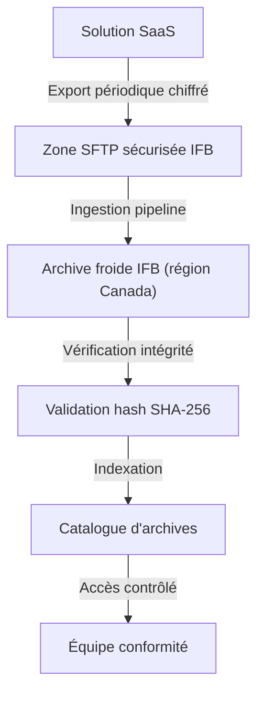

# Données – Classification, rétention et archivage – SaaS

---

**Métadonnées**

| Champ         | Valeur                                                                     |
|---------------|----------------------------------------------------------------------------|
| Titre         | Données – Classification, rétention et archivage – Solutions SaaS         |
| ID            | DATA-GOV-009                                                               |
| Version       | 1.5                                                                        |
| Statut        | Approuvé                                                                   |
| Auteur        | Architecte données – Gouvernance et conformité de l'information            |
| Date          | 2024-12-03                                                                 |
| Documents liés | 01-principes-architecture-integration-saas.md, 02-exigences-securite-saas.md, 03-architecture-solution-saas-rh.md, 05-architecture-solution-saas-fraude.md |

---

## 1. Objectif

Ce document définit le cadre de classification des données, les règles de rétention, d'archivage et de minimisation applicables aux données traitées ou hébergées dans les solutions SaaS adoptées par l'IFB. Il s'appuie sur la politique de gouvernance des données d'IFB (PGD-2023) et intègre les contraintes légales et réglementaires applicables.

---

## 2. Cadre de classification des données

L'IFB utilise quatre niveaux de classification :

| Niveau | Nom              | Description                                                                 | Exemples                                        |
|--------|------------------|-----------------------------------------------------------------------------|-------------------------------------------------|
| C1     | Public           | Information publiquement accessible ou sans impact si divulguée             | Documentation produit, taux d'intérêt publiés   |
| C2     | Interne          | Information à usage interne, impact limité si divulguée                     | Procédures internes, rapports de performance    |
| C3     | Confidentiel     | Information sensible dont la divulgation causerait un préjudice significatif| Profil client, données employé, transactions    |
| C4     | Restreint        | Information hautement sensible soumise à des obligations légales strictes    | NAS, données médicales, dossiers d'investigation|

### 2.1 Règles de classification pour les SaaS

- La classification est assignée par le propriétaire des données (data owner), pas par l'équipe technique
- Un SaaS traitant des données C3 ou C4 est automatiquement soumis aux contrôles renforcés définis dans 02-exigences-securite-saas.md
- La classification doit être documentée dans la fiche de solution avant la mise en production

> **Note :** En pratique, la classification est souvent réalisée par l'équipe technique par défaut d'implication du data owner. Cette situation a été identifiée comme risque de gouvernance lors de l'audit de 2024. Des mesures correctives sont en cours.

---

## 3. Minimisation des données

Le principe de minimisation impose que seules les données strictement nécessaires à la fonction métier visée soient transmises à un SaaS.

**Contrôles appliqués :**
- Revue de la liste des champs transmis lors de la revue de sécurité (Gate 2)
- Validation par le data owner de la justification de chaque donnée C3/C4 transmise
- Masquage ou tokenisation des identifiants directs lorsque la fonction peut s'en passer (ex : analytique)

**Exemples d'application :**
- NexaCRM (CRM) ne reçoit pas le NAS client, uniquement un identifiant opaque interne
- PeopléSphere (RH) ne reçoit pas les données médicales (gérées dans un module distinct, hors périmètre SaaS)
- SentinelRisk (fraude) reçoit les données transactionnelles complètes, justifiées par la fonction de détection

---

## 4. Rétention des données dans les SaaS

### 4.1 Règles générales

| Type de données             | Rétention standard     | Rétention légale / réglementaire |
|-----------------------------|------------------------|----------------------------------|
| Données client (C3)         | Durée de la relation + 7 ans | Loi sur les banques : variable  |
| Données employé (C3)        | Durée d'emploi + 7 ans | Norme provinciale                |
| Journaux d'audit (C2)       | 7 ans                  | FINTRAC, CANAFE                  |
| Données transactionnelles   | 7 ans                  | Réglementation bancaire          |
| Dossiers AML/enquêtes (C4)  | 7 ans après clôture    | FINTRAC obligatoire              |
| Données analytiques (C2)    | 3 ans                  | –                                |

### 4.2 Rétention dans les SaaS vs IFB

> ⚠️ **Point de friction fréquent :**

Les SaaS ont souvent leurs propres politiques de rétention qui ne correspondent pas à celles d'IFB. Deux situations problématiques observées :

**Situation A – Rétention trop courte :** Le SaaS purge les données avant la durée de rétention IFB. Dans ce cas, IFB doit extraire et archiver les données avant la purge. Ce flux d'archivage doit être documenté et automatisé.

**Situation B – Rétention trop longue :** Le SaaS conserve les données au-delà de la durée IFB. Ce cas est plus difficile à gérer contractuellement. IFB doit obtenir la garantie de suppression effective à la fin de la période de rétention.

Les deux situations sont documentées dans les fiches de solution individuelles.

---

## 5. Archivage

### 5.1 Processus d'archivage SaaS → IFB

Pour les données soumises à des obligations de conservation réglementaire, un processus d'archivage est requis :

### 5.2 Intégrité des archives

- Les archives doivent être hachées (SHA-256) au moment de la création et vérifiées périodiquement
- Pour les dossiers AML et d'enquête : mode WORM (Write Once Read Many) obligatoire
- Les archives sont stockées dans la région Canada uniquement

---

## 6. Résidence des données – Contraintes légales

La Loi 25 (Québec) et le PIPEDA (fédéral) imposent des contraintes sur la collecte, le traitement et le transfert des renseignements personnels.

**Principes applicables aux SaaS :**

1. Les renseignements personnels ne peuvent être communiqués hors du Québec/Canada qu'avec le consentement ou dans le cadre d'une évaluation des facteurs relatifs à la vie privée (ÉFVP)
2. Une ÉFVP doit être réalisée avant tout transfert de données C3/C4 vers un SaaS dont la résidence est hors Canada
3. Le fournisseur doit assurer un niveau de protection équivalent à celui de la loi provinciale

**Situations en cours d'analyse :**

- NexaCRM : sauvegardes DRP en région américaine (04-architecture-solution-saas-crm.md) – ÉFVP en cours
- SentinelRisk : partage de données anonymisées pour l'amélioration des modèles ML (05-architecture-solution-saas-fraude.md) – analyse BPD en cours

> TBD – en attente du comité d'architecture : La liste exhaustive des SaaS ayant des flux hors Canada n'a pas encore été finalisée. Un inventaire est demandé au Bureau de la Protection des Données.

---

## 7. Suppressions et droit à l'oubli

Dans le cadre de la Loi 25, les individus peuvent demander la suppression de leurs renseignements personnels. Pour les SaaS :

- La demande de suppression doit être propagée à tous les SaaS détenant les données concernées
- Le délai de propagation doit être documenté (SLA interne : 30 jours)
- La confirmation de suppression effective doit être conservée

**Défi opérationnel :** L'inventaire des SaaS détenant les données d'un individu donné n'est pas automatisé. Des workflows manuels sont en place. Un projet de cartographie automatisée est à l'étude.

---

## 8. Hypothèses et risques

**Hypothèses :**
- Les data owners sont identifiés pour chaque domaine de données avant la mise en production d'un SaaS
- Les fournisseurs SaaS sont capables de supprimer les données individuellement sur demande
- Les contrats incluent des clauses de suppression certifiée en fin de contrat

**Risques :**
- Données classifiées erronément (trop bas) : exposition non détectée
- Absence d'automatisation des workflows de suppression : risque de non-conformité Loi 25
- Flux d'archivage non testés : risque de perte de données réglementaires
- Certains SaaS ne peuvent pas garantir la suppression complète de données dans leurs environnements de backup

---

*Document maintenu par l'équipe Gouvernance des données – Architecture d'information, IFB.*
