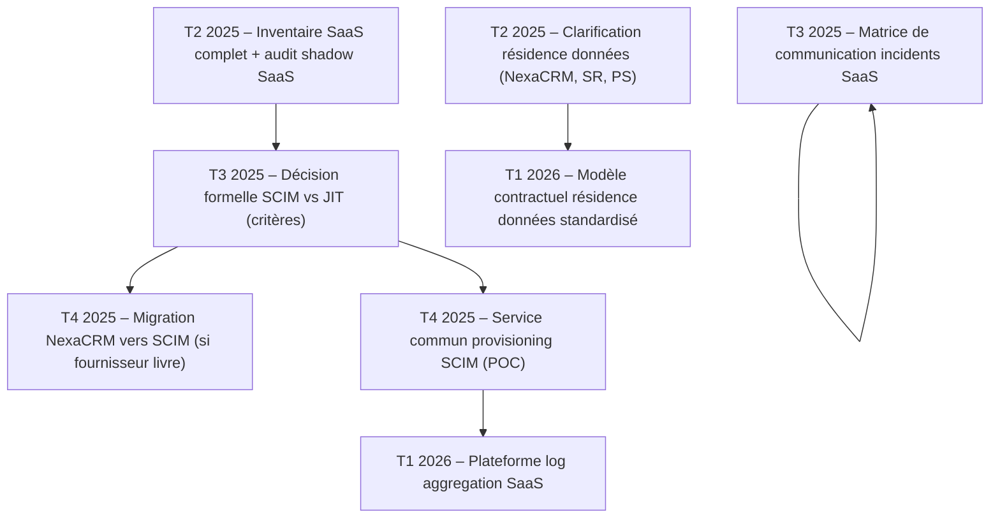

# Portrait global – Architecture SaaS de l'IFB

---

**Métadonnées**

| Champ         | Valeur                                                                      |
|---------------|-----------------------------------------------------------------------------|
| Titre         | Portrait global – Architecture SaaS de l'IFB                               |
| ID            | ARCH-GLOBAL-010                                                             |
| Version       | 1.0                                                                         |
| Statut        | Approuvé – revue semestrielle                                               |
| Auteur        | Architecte d'entreprise principal – Direction Architecture et Innovation    |
| Date          | 2025-03-31                                                                  |
| Documents liés | 01-principes-architecture-integration-saas.md, 02-exigences-securite-saas.md, 06-patterns-integration-saas.md, 07-patterns-identite-saas.md, 08-exploitabilite-operations-saas.md, 09-donnees-classification-retention-saas.md |

---

## 1. Objectif

Ce document offre une vue d'ensemble de l'écosystème SaaS de l'Institution Financière Boréale (IFB). Il consolide le paysage applicatif SaaS actuel, identifie les enjeux communs et transversaux, et propose une feuille de route de standardisation.

Il s'adresse au comité d'architecture d'entreprise, à la direction TI et aux responsables de domaines métier.

---

## 2. Paysage SaaS actuel

### 2.1 Inventaire des solutions en production et en déploiement

| Solution         | Domaine           | ID Doc                | Tier  | Statut             | Provisioning | SSO      |
|------------------|-------------------|-----------------------|-------|--------------------|--------------|----------|
| PeopléSphere     | Ressources humaines | SOL-RH-003          | 2     | En production      | SCIM (partiel) | SAML   |
| NexaCRM          | Expérience client | SOL-CRM-004           | 2     | Approbation pendante | JIT → SCIM  | OIDC   |
| SentinelRisk     | Fraude / AML      | SOL-FRAUD-005         | 1     | En production      | SCIM complet | SAML    |
| *(ITSM-SaaS)*    | Services TI       | En cours de rédaction | 2     | Évaluation         | Inconnu      | Inconnu |
| *(Collab-Data)*  | Analytique        | Non rédigé            | 3     | POC                | –            | –       |

> **Note :** Cet inventaire est partiel. L'équipe Gouvernance TI a identifié au moins 4 autres SaaS utilisés par des équipes métier sans avoir suivi le processus d'approbation formel. Un audit de découverte est prévu T2 2025.

### 2.2 Vue d'ensemble architecturale

```mermaid
graph TD
    subgraph SaaS_Couche["Couche SaaS"]
        PS["PeopléSphere (RH)"]
        CRM["NexaCRM (CRM)"]
        SR["SentinelRisk (Fraude)"]
        ITSM["ITSM-SaaS (en évaluation)"]
    end

    subgraph IFB_Couche["Couche d'intégration IFB"]
        APIGW["API Gateway"]
        ESB["Bus d'événements (Kafka)"]
        IAM["Plateforme IAM / IdP"]
        VAULT["CoffreVault (secrets)"]
        SIEM["SIEM (journalisation)"]
    end

    subgraph Systemes_IFB["Systèmes cœur IFB"]
        CORE["Cœur bancaire"]
        MDM["MDM-Client"]
        DWH["Entrepôt de données"]
        PAIE["Système paie"]
    end

    PS -->|SCIM / SAML| IAM
    CRM -->|JIT / OIDC| IAM
    SR -->|SCIM / SAML| IAM
    
    PS -->|API / Webhook| APIGW
    CRM -->|API / Webhook| APIGW
    SR -->|API (lien dédié P1)| APIGW
    
    APIGW --> ESB
    ESB --> CORE
    ESB --> MDM
    ESB --> DWH
    ESB --> PAIE
    
    PS --> SIEM
    CRM --> SIEM
    SR --> SIEM
    
    IAM --> VAULT
```

---

## 3. Enjeux communs identifiés

L'analyse transversale des documents de solution révèle plusieurs enjeux récurrents qui ne sont pas propres à une solution mais caractérisent l'ensemble de l'écosystème SaaS IFB.

### 3.1 Débat SCIM vs JIT – non résolu

Le débat entre provisioning SCIM v2 et JIT est récurrent et non encore résolu à l'échelle de l'écosystème.

- **SCIM** est la cible officielle (ARCH-PRINC-001, P-01) mais n'est pas supporté par tous les SaaS
- **JIT** est la solution de fait pour les SaaS sans SCIM, mais génère des risques de comptes orphelins
- **SentinelRisk** est le seul SaaS à avoir implémenté SCIM complet en production (cas référence)
- **NexaCRM** est en dérogation JIT avec plan de migration T4 2025 (non garanti)

*Référence : 07-patterns-identite-saas.md, sections 3 et 4*

> Ce point a été soulevé dans au moins 3 revues de comité depuis 2023 sans décision formelle sur les critères d'acceptation du JIT prolongé. Une décision est requise.

### 3.2 Résidence des données – zone grise persistante

La résidence des données dans les SaaS reste une zone d'incertitude dans plusieurs solutions :

| Solution     | Enjeu résidence                                      | Statut             |
|--------------|------------------------------------------------------|--------------------|
| NexaCRM      | Sauvegardes DRP en région américaine                 | ÉFVP en cours      |
| NexaCRM      | Télémétrie fournisseur : localisation non divulguée  | En attente réponse |
| SentinelRisk | Données d'entraînement ML : localisation fournisseur | Analyse BPD        |
| PeopléSphere | Accès support hors Canada aux données de configuration | Analyse BPD      |

*Référence : 09-donnees-classification-retention-saas.md, section 6*

La situation actuelle expose IFB à un risque de non-conformité avec la Loi 25. Une clarification urgente est requise avec les fournisseurs concernés.

### 3.3 Surveillance incomplète

La couverture du monitoring centralisé est partielle :
- 3 SaaS sur 9+ ne sont pas encore instrumentés dans le tableau de bord OPS
- Les logs applicatifs (actions fonctionnelles) ne sont pas transmis au SIEM pour plusieurs solutions
- La matrice de communication pour les incidents SaaS n'est pas formalisée

*Référence : 08-exploitabilite-operations-saas.md, sections 3 et 4*

### 3.4 Prolifération SaaS non gouvernée

Des SaaS sont utilisés en production sans avoir suivi le processus d'approbation officiel. Ce phénomène, parfois appelé "shadow SaaS", crée :
- Des intégrations non documentées
- Des données hors du registre de classification
- Des risques de sécurité non traités

### 3.5 Exceptions qui s'accumulent

Le volume d'exceptions formelles au cadre de sécurité SaaS a augmenté de 40% en 2024. Si cette tendance se poursuit, les exceptions deviendront la norme plutôt que l'exception, ce qui affaiblit le cadre de gouvernance.

*Référence : 02-exigences-securite-saas.md, section 9*

---

## 4. Opportunités de standardisation

Sur la base des enjeux identifiés, les opportunités de standardisation suivantes sont proposées :

### OPP-01 : Service commun de provisioning SCIM

Développer ou acquérir un middleware de provisioning qui traduit les événements AD/LDAP en appels SCIM pour les SaaS qui ne supportent pas SCIM nativement. Cela permettrait de maintenir SCIM comme standard effectif tout en réduisant la complexité d'implémentation côté SaaS.

### OPP-02 : Modèle contractuel standard pour la résidence des données

Élaborer un addenda contractuel standard (avec le Bureau juridique et le BPD) que tous les fournisseurs SaaS doivent signer, précisant explicitement la résidence des données de production, de sauvegarde, de support et de télémétrie.

### OPP-03 : Plateforme de log aggregation SaaS

Mettre en place un collecteur de logs centralisé capable d'ingérer les formats variés des SaaS et de les normaliser avant transmission au SIEM. Réduirait les lacunes de couverture et simplifierait l'onboarding de nouveaux SaaS.

### OPP-04 : Processus d'approbation SaaS accéléré (fast track)

Créer une voie d'approbation rapide pour les SaaS à faible risque (Tier 3, données C1/C2 seulement) avec des contrôles allégés mais documentés. Réduirait l'incitation à contourner le processus.

---

## 5. Feuille de route recommandée



> TBD – en attente du comité d'architecture : La feuille de route ci-dessus est une proposition de l'équipe Architecture d'entreprise. Elle n'est pas encore approuvée et doit être validée avec les responsables de domaines et la direction TI.

---

## 6. Points de décision requis

Les points suivants nécessitent une décision formelle du comité d'architecture :

| # | Question                                                      | Impact si non résolu        |
|---|---------------------------------------------------------------|-----------------------------|
| 1 | Critères d'acceptation du JIT comme solution permanente       | Gouvernance identité affaiblie |
| 2 | Exigences minimales de résidence des données pour les SaaS    | Risque conformité Loi 25    |
| 3 | Convergence ESB legacy vs Kafka                               | Ambiguïté patterns intégration |
| 4 | Fast track approbation pour SaaS Tier 3                       | Prolifération shadow SaaS   |

---

## 7. Risques transversaux

| Risque                                           | Niveau  | Documents concernés                           |
|--------------------------------------------------|---------|-----------------------------------------------|
| Non-conformité Loi 25 (résidence données)        | Élevé   | 04, 05, 09                                    |
| Comptes orphelins (JIT sans gouvernance)         | Moyen   | 04, 07                                        |
| Shadow SaaS non gouverné                         | Moyen   | 01, 02                                        |
| Surveillance incomplète (monitoring SaaS)        | Moyen   | 08                                            |
| Prolifération d'exceptions sécurité              | Moyen   | 02                                            |

---

*Document maintenu par l'équipe Architecture d'entreprise – Direction Stratégie et Architecture, IFB.*
