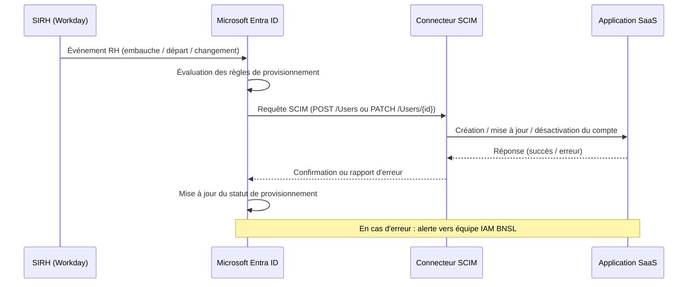

# BNSL-ARCH-SAAS-001 — Standard IAM pour les solutions SaaS — Fédération, provisionnement et gouvernance des accès

| Champ            | Valeur                                      |
|------------------|---------------------------------------------|
| **Version**      | 1.2                                         |
| **Statut**       | Approuvé                                    |
| **Propriétaire** | Direction Architecture de Sécurité — BNSL  |
| **Date de révision** | 2025-11-15                              |
| **Domaine**      | Identité et Accès (IAM) — SaaS              |

---

## 1. Objectif et portée

Ce standard définit les exigences minimales de gestion des identités et des accès (IAM) applicables à **toutes les solutions SaaS adoptées par la Banque Nordique du Saint-Laurent (BNSL)**, qu'il s'agisse de SaaS hébergés dans le nuage public ou de solutions multi-locataires gérées par un tiers.

L'objectif principal est d'**éliminer les silos d'identité** (comptes locaux non fédérés, annuaires parallèles) et de **réduire la surface d'attaque** liée à la prolifération de justificatifs d'identité. Tout SaaS retenu dans le cadre d'une évaluation d'architecture doit satisfaire les exigences du présent document avant la mise en production.

Ce standard s'applique à :
- Les SaaS achetés dans le cadre d'une initiative de transformation numérique ou d'optimisation opérationnelle ;
- Les SaaS utilisés par des employés BNSL, des sous-traitants ou des partenaires avec accès aux systèmes BNSL ;
- Les SaaS auxquels accèdent des comptes de service ou des intégrations automatisées.

---

## 2. Exigence de fédération SSO

### 2.1 Identity Provider unique

La BNSL a désigné **Microsoft Entra ID (anciennement Azure Active Directory)** comme unique fournisseur d'identité (IdP) corporatif. Tout SaaS retenu **doit** s'intégrer à cet IdP pour l'authentification des utilisateurs.

Les protocoles de fédération acceptés sont :
- **SAML 2.0** (protocole privilégié pour les SaaS d'entreprise matures)
- **OpenID Connect (OIDC)** (protocole préféré pour les SaaS natifs nuage et les applications modernes)
- **WS-Federation** : accepté uniquement pour les SaaS Microsoft héritages (SharePoint On-Premises, etc.) — à éviter pour les nouveaux projets

L'authentification locale (identifiants propres au SaaS, gérés par le fournisseur) est **interdite en production** sauf exception formellement documentée (voir section 2.2).

### 2.2 Processus d'exception

Lorsqu'un fournisseur SaaS ne supporte pas la fédération SSO via Entra ID, une dérogation doit être soumise à l'équipe Architecture de Sécurité. La dérogation doit documenter :
- La raison technique de l'impossibilité de fédérer ;
- Les contrôles compensatoires proposés (MFA renforcé, rotation des mots de passe, monitoring accru) ;
- Un engagement du fournisseur à implémenter SSO dans la prochaine version majeure.

Les dérogations sont valides pour une durée maximale de 12 mois et doivent être renouvelées.

---

## 3. Provisionnement automatisé des identités

### 3.1 Standard SCIM 2.0

Le provisionnement et le déprovisionnement des comptes utilisateurs dans les SaaS doit être **automatisé via le protocole SCIM 2.0** (System for Cross-domain Identity Management), piloté depuis Entra ID.

Comportements attendus :

| Événement RH                    | Action SCIM attendue                                | Délai maximum        |
|---------------------------------|-----------------------------------------------------|----------------------|
| Embauche / création de compte   | Création du compte dans le SaaS                     | 4 heures ouvrables   |
| Changement de rôle              | Mise à jour des groupes et attributs                | 24 heures ouvrables  |
| Suspension temporaire           | Désactivation du compte (sans suppression)          | 2 heures             |
| Départ de l'organisation        | Désactivation immédiate + suppression sous 30 jours | **Immédiat**         |

> **Exigence critique** : Le délai de **déprovisionnement après départ d'un employé** ne peut excéder **4 heures** pour les SaaS classifiés Confidentiel ou Restreint. Ce délai est déclenché par la notification de fin de contrat dans le SIRH (Workday).

### 3.2 SaaS sans support SCIM

Pour les SaaS ne supportant pas SCIM, le provisionnement manuel est toléré uniquement pour les SaaS classifiés Public ou Interne, avec une revue trimestrielle des comptes obligatoire. Un chantier d'automatisation doit être planifié.

---

## 4. Authentification multifacteur (MFA)

Le MFA est **obligatoire sans exception** pour tous les comptes humains accédant à un SaaS BNSL. La politique de force d'authentification est définie via les **Politiques d'Accès Conditionnel Entra ID** et varie selon la classification des données traitées par le SaaS :

| Classification des données | Force MFA requise                                     | Méthodes acceptées                          |
|----------------------------|-------------------------------------------------------|---------------------------------------------|
| Publique                   | MFA standard                                          | Authenticator App, SMS, TOTP                |
| Interne                    | MFA standard                                          | Authenticator App, TOTP                     |
| Confidentielle             | MFA résistant au phishing                             | Microsoft Authenticator (notification push) |
| Restreinte                 | MFA résistant au phishing + accès conditionnel strict | FIDO2 / clé matérielle, Authenticator App   |

Le SMS comme facteur MFA est **déprécié** pour les classifications Confidentielle et Restreinte en raison des risques de SIM swapping.

---

## 5. Comptes non-humains

Les comptes de service, comptes d'intégration et clés API utilisés par des systèmes automatisés sont soumis aux règles suivantes :

- **Interdiction des comptes partagés** : chaque intégration ou composant technique doit posséder son propre compte de service avec des permissions minimales (principe du moindre privilège).
- **Rotation des secrets** : les mots de passe de comptes de service et clés API doivent être rotés selon la fréquence définie dans BNSL-SEC-SECRETS-001 (minimalement tous les 90 jours pour les SaaS Confidentiels/Restreints).
- **Stockage des secrets** : les secrets doivent être gérés via HashiCorp Vault ou Azure Key Vault — jamais en clair dans des fichiers de configuration, dépôts de code ou variables d'environnement non chiffrées.
- **Comptes d'intégration SaaS** : doivent être liés à un compte technique Entra ID (service principal), jamais à un compte personnel d'employé.

---

## 6. Comptes d'urgence locaux (break glass)

Certains SaaS peuvent nécessiter des comptes locaux d'urgence pour les scénarios de panne de l'IdP. Ces comptes sont soumis aux conditions suivantes :

- Leur usage est **réservé aux incidents** où Entra ID est indisponible et où l'accès au SaaS est critique ;
- Ils doivent être **documentés dans le registre des actifs IAM** de la BNSL ;
- Les identifiants sont stockés dans un coffre-fort physique sécurisé avec accès contrôlé et journalisé ;
- **Toute utilisation doit être journalisée** et un incident de sécurité ouvert dans ServiceNow dans les 30 minutes suivant l'usage ;
- Une **revue trimestrielle** est obligatoire pour confirmer la nécessité de chaque compte break glass et la validité des identifiants.

---

## 7. Revue des accès

| Criticité du SaaS | Fréquence de revue | Outillage recommandé              |
|-------------------|--------------------|-----------------------------------|
| Critique          | Trimestrielle       | Entra ID Access Reviews           |
| Important         | Semestrielle        | Entra ID Access Reviews           |
| Standard          | Annuelle            | Export manuel + validation métier |

Les résultats des revues doivent être conservés 3 ans à des fins d'audit.

---

## 8. Matrice de configuration IAM par classification

| Exigence                        | Publique     | Interne      | Confidentielle     | Restreinte            |
|---------------------------------|--------------|--------------|--------------------|-----------------------|
| SSO fédéré (Entra ID)           | Recommandé   | Obligatoire  | Obligatoire        | Obligatoire           |
| SCIM 2.0                        | Optionnel    | Recommandé   | Obligatoire        | Obligatoire           |
| MFA                             | Obligatoire  | Obligatoire  | MFA anti-phishing  | FIDO2 / matériel      |
| Accès conditionnel              | Basique      | Standard     | Renforcé           | Maximal               |
| Comptes break glass             | Non requis   | Optionnel    | Encadré            | Encadré + HSM         |
| Revue des accès                 | Annuelle     | Semestrielle | Trimestrielle      | Trimestrielle         |
| Délai déprov. départ            | 48h          | 24h          | 4h                 | Immédiat (< 1h)       |

---

## 9. Flux de provisionnement — Diagramme

---

## 10. Gouvernance des accès privilégiés (PAM)

> ⚠️ **TODO** : La gouvernance des accès privilégiés (PAM) dans les environnements SaaS — incluant la gestion des comptes administrateurs fournisseurs, le just-in-time access et le session recording — fait l'objet d'un cadre distinct en cours de développement. Se référer au document **BNSL-SEC-PAM-001** (non encore publié). En attendant, les administrateurs SaaS doivent appliquer le principe du moindre privilège et journaliser toutes les actions administratives.

---

## Références

### Documents BNSL connexes
- `BNSL-ARCH-SAAS-002` — Guide de journalisation et d'observabilité pour les solutions SaaS
- `BNSL-ARCH-SAAS-003` — Guide d'intégration entrante via l'API Gateway BNSL
- `BNSL-SEC-SECRETS-001` — Gestion des secrets et rotation des identifiants
- `BNSL-SEC-PAM-001` — Gouvernance des accès privilégiés (non encore publié)
- `BNSL-CLASS-DATA-001` — Cadre de classification des données BNSL

### Sources externes et réglementaires
- OSFI Ligne directrice B-10 — Risque lié aux tiers et à la chaîne d'approvisionnement technologique
- PIPEDA — Loi sur la protection des renseignements personnels et les documents électroniques
- Loi 25 (Québec) — Loi modernisant des dispositions législatives en matière de protection des renseignements personnels
- NIST SP 800-63B — Digital Identity Guidelines (Authentication)
- Microsoft Entra ID — Documentation officielle SCIM et Accès conditionnel
