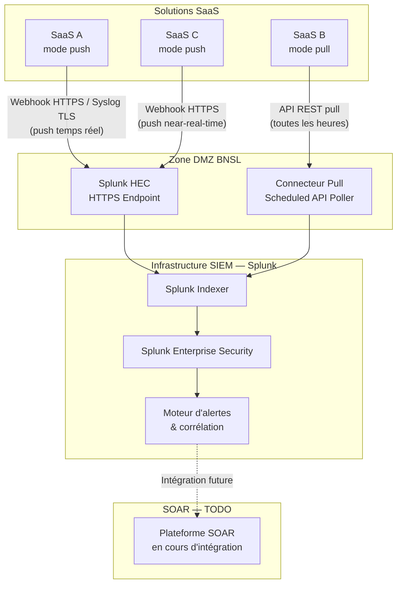

# BNSL-ARCH-SAAS-002 — Guide de journalisation et d'observabilité pour les solutions SaaS

| Champ            | Valeur                                          |
|------------------|-------------------------------------------------|
| **Version**      | 1.1                                             |
| **Statut**       | Approuvé                                        |
| **Propriétaire** | Direction Cybersécurité et Conformité — BNSL   |
| **Date de révision** | 2025-10-01                                  |
| **Domaine**      | Journalisation, Observabilité, SIEM — SaaS      |

---

## 1. Objectif et portée

Ce guide définit les **exigences de journalisation** applicables à toutes les solutions SaaS adoptées par la Banque Nordique du Saint-Laurent (BNSL). Il vise à garantir que les journaux nécessaires à la **détection d'incidents**, à la **conformité réglementaire** et à la **forensique numérique** soient collectés, centralisés et conservés de façon adéquate.

Le respect de ce guide est évalué lors de l'étape d'évaluation d'architecture de tout nouveau SaaS, et fait partie des critères contractuels obligatoires dans les contrats de services SaaS.

Ce guide s'applique à :
- Tous les SaaS en production traitant des données de la BNSL, de ses employés ou de ses clients ;
- Les environnements de qualification (UAT) lorsqu'ils traitent des données réelles ou des données de production masquées.

---

## 2. Contexte réglementaire

La BNSL est soumise à plusieurs cadres réglementaires qui imposent des obligations de journalisation précises :

| Cadre réglementaire   | Exigence principale                                                                 |
|-----------------------|-------------------------------------------------------------------------------------|
| **OSFI B-10**         | Traçabilité des accès et des actions sur les systèmes critiques ; audit trail pour les tiers | 
| **PIPEDA**            | Journalisation des accès aux renseignements personnels ; capacité d'investigation en cas de brèche |
| **Loi 25 (Québec)**   | Obligation de documenter tout incident de confidentialité ; registre des incidents    |
| **FINTRAC**           | Conservation des dossiers transactionnels à des fins de déclaration                 |
| **Politique interne BNSL** | Rétention minimale de **7 ans** pour les journaux à valeur probante (pistes d'audit) |

---

## 3. Catégories de journaux exigés

Tout SaaS classifié Critique ou Important (voir section 7) doit être en mesure de produire les quatre catégories de journaux suivantes.

### 3.1 Journaux d'authentification et d'accès

Ces journaux documentent **qui s'est connecté, quand et depuis où** :
- Succès et échecs d'authentification (avec adresse IP source, agent utilisateur, méthode d'auth)
- Déconnexions (explicites et expiration de session)
- Tentatives d'élévation de privilèges ou de changement de rôle
- Accès depuis des localisations géographiques inhabituelles

### 3.2 Journaux d'actions administratives

Ces journaux documentent les **modifications de configuration** et la **gestion des droits** dans le SaaS :
- Création, modification et suppression de comptes utilisateurs
- Changements de permissions et d'appartenance aux groupes
- Modifications de la configuration de sécurité du SaaS (SSO, MFA, politiques de session)
- Exports de données en masse ou téléchargements de rapports sensibles

### 3.3 Journaux d'activité métier à valeur probante

Pour les SaaS traitant des données à valeur transactionnelle ou contractuelle, les journaux doivent capturer :
- Approbation ou rejet d'une transaction financière
- Modification d'un profil client (données personnelles, données KYC)
- Génération de documents réglementaires (relevés, confirmations, attestations)
- Toute action irréversible sur une donnée critique

> Ces journaux constituent une **piste d'audit** au sens légal. Ils doivent être **immuables** et conservés 7 ans.

### 3.4 Journaux d'intégration

Ces journaux documentent les flux entre le SaaS et les systèmes BNSL :
- Appels API entrants et sortants (point d'entrée, endpoint, code de réponse HTTP, latence)
- Erreurs de synchronisation de données (batch ou temps réel)
- Échecs d'authentification entre systèmes (OAuth, SCIM, webhooks)
- Volumes de données échangés (pour détecter les exfiltrations anormales)

---

## 4. Mécanismes d'export des journaux

### 4.1 Modes d'export

| Mode       | Description                                              | Préférence BNSL       |
|------------|----------------------------------------------------------|-----------------------|
| **Push**   | Le SaaS pousse les logs en temps réel ou near-real-time vers un endpoint BNSL (webhook, HTTPS, Syslog over TLS) | Préféré               |
| **Pull**   | La BNSL interroge périodiquement une API du SaaS pour collecter les logs | Accepté (si push indisponible) |
| **Export manuel** | Téléchargement manuel de fichiers CSV/JSON depuis l'interface admin | Inacceptable en production — usage forensique uniquement |

### 4.2 Formats acceptés

- **JSON** (format privilégié pour l'intégration avec Splunk)
- **CEF** (Common Event Format) — pour la compatibilité SIEM
- **Syslog (RFC 5424)** over TLS — pour les connecteurs legacy

Les formats propriétaires non convertibles en JSON ou CEF doivent faire l'objet d'une évaluation par l'équipe SIEM avant adoption.

### 4.3 Exigences techniques

- Latence maximale entre l'événement et la disponibilité du journal dans l'export : **15 minutes** (mode push) ou **1 heure** (mode pull)
- Les timestamps doivent être en **UTC ISO 8601** avec précision à la milliseconde
- Les journaux doivent inclure un identifiant corrélable avec les journaux d'autres systèmes (ex. : identifiant de session Entra ID, identifiant de transaction)

---

## 5. Centralisation SIEM

Tous les journaux SaaS doivent être **agrégés vers le SIEM central BNSL**, exploité sur **Splunk Enterprise Security**.

Exigences :
- Délai maximal d'ingestion dans Splunk : **30 minutes** depuis la génération du journal (SaaS Critique), **2 heures** (SaaS Important)
- Les index Splunk sont attribués par l'équipe SIEM selon la classification du SaaS
- Des **règles de corrélation de base** doivent être créées lors de l'intégration de tout SaaS Critique :
  - Alerte sur N échecs d'authentification successifs (brute force)
  - Alerte sur accès depuis un pays hors de la liste blanche BNSL
  - Alerte sur export de données massif inhabituel
  - Alerte sur action administrative réalisée hors des heures ouvrables

---

## 6. Exigences contractuelles envers le fournisseur SaaS

Les contrats de services SaaS doivent stipuler les obligations suivantes :

| Obligation                                  | Détail                                                                              |
|---------------------------------------------|-------------------------------------------------------------------------------------|
| Durée de rétention native des logs          | Minimum 90 jours dans l'interface du SaaS ; 1 an pour les pistes d'audit           |
| Accès aux logs sans surcoût                 | L'accès aux journaux via API ne doit pas entraîner de frais supplémentaires         |
| Immutabilité des journaux                   | Les journaux ne doivent pas pouvoir être modifiés ou supprimés par un utilisateur standard ou administrateur SaaS |
| Notification de perte de journaux           | Le fournisseur doit notifier la BNSL dans les 24h si une perte ou corruption de journaux est détectée |
| Accès forensique en cas d'incident          | Le fournisseur doit fournir un accès étendu aux journaux sur demande de l'équipe BNSL Cyber dans un délai de 4h |

---

## 7. Lacunes fréquentes lors de l'évaluation d'un SaaS

Lors de l'évaluation architecture d'un nouveau SaaS, les questions suivantes doivent systématiquement être posées au fournisseur :

- [ ] Le SaaS expose-t-il une API de journalisation en temps réel ou near-real-time ?
- [ ] Les journaux d'authentification distinguent-ils les connexions humaines des appels système ?
- [ ] Les journaux sont-ils disponibles en JSON ou CEF ?
- [ ] Les journaux d'actions administratives sont-ils séparés des journaux d'activité métier ?
- [ ] Le fournisseur peut-il démontrer l'immutabilité de ses journaux (ex. : stockage WORM) ?
- [ ] Y a-t-il des catégories d'actions qui ne sont pas journalisées ? Lesquelles ?
- [ ] Quel est le délai maximal de disponibilité des journaux après l'événement ?
- [ ] Les logs sont-ils inclus dans le contrat standard ou font-ils l'objet d'un module payant séparé ?

---

## 8. Exigences par niveau de criticité

| Exigence                             | SaaS Critique          | SaaS Important         | SaaS Standard          |
|--------------------------------------|------------------------|------------------------|------------------------|
| Journaux d'authentification          | Obligatoire            | Obligatoire            | Obligatoire            |
| Journaux d'actions admin             | Obligatoire            | Obligatoire            | Recommandé             |
| Journaux d'activité métier           | Obligatoire            | Recommandé             | Optionnel              |
| Journaux d'intégration               | Obligatoire            | Obligatoire            | Recommandé             |
| Mode push vers SIEM                  | Obligatoire            | Recommandé             | Optionnel              |
| Délai d'ingestion SIEM               | 30 minutes             | 2 heures               | 24 heures              |
| Rétention native SaaS                | 1 an                   | 90 jours               | 30 jours               |
| Règles de corrélation Splunk         | Obligatoire            | Recommandé             | Optionnel              |

---

## 9. Architecture de collecte des journaux — Diagramme

---

## 10. Intégration SOAR

> ⚠️ **TODO** : L'intégration avec la plateforme SOAR (Security Orchestration, Automation and Response) de la BNSL — permettant la réponse automatisée aux incidents détectés via Splunk — est en cours de développement. Les playbooks de réponse automatique pour les incidents SaaS (verrouillage de compte, révocation de token, notification des équipes) seront documentés dans un guide dédié. Contacter l'équipe Cyber Opérations pour l'état d'avancement.

---

## Références

### Documents BNSL connexes
- `BNSL-ARCH-SAAS-001` — Standard IAM pour les solutions SaaS
- `BNSL-ARCH-SAAS-003` — Guide d'intégration entrante via l'API Gateway BNSL
- `BNSL-ARCH-SAAS-005` — Guide de réseautique et de segmentation pour les intégrations SaaS
- `BNSL-SEC-SIEM-001` — Architecture et gouvernance du SIEM Splunk BNSL

### Sources externes et réglementaires
- OSFI Ligne directrice B-10 — Risque lié aux tiers
- PIPEDA — Obligations en matière de brèches de sécurité (art. 10.1)
- Loi 25 (Québec) — Obligation de tenue d'un registre des incidents
- FINTRAC — Exigences de conservation des dossiers
- Splunk — Documentation Splunk HEC (HTTP Event Collector)
- NIST SP 800-92 — Guide to Computer Security Log Management
