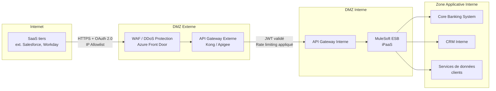

# BNSL-ARCH-SAAS-003 — Guide d'intégration entrante via l'API Gateway BNSL — Flux SaaS vers systèmes internes

| Champ            | Valeur                                                  |
|------------------|---------------------------------------------------------|
| **Version**      | 1.0                                                     |
| **Statut**       | Approuvé                                                |
| **Propriétaire** | Direction Architecture de Solution — Intégration BNSL  |
| **Date de révision** | 2025-09-20                                          |
| **Domaine**      | Intégration, API Gateway, Sécurité des flux entrants    |

---

## 1. Objectif et portée

Ce guide décrit comment un **SaaS tiers peut consommer des services ou des données exposés par la BNSL**, de façon sécurisée et gouvernée. Il définit les patrons d'appel approuvés, les mécanismes de sécurité obligatoires, et le processus d'enregistrement d'un SaaS comme consommateur d'API BNSL.

Tout SaaS souhaitant appeler des services internes de la BNSL doit respecter les dispositions du présent guide. Les intégrations non conformes ne seront pas autorisées en production.

Prérequis IAM : tout SaaS intégré via l'API Gateway doit satisfaire les exigences d'authentification définies dans **BNSL-ARCH-SAAS-001**.

---

## 2. Architecture de l'API Gateway BNSL

### 2.1 Plateforme Gateway

La BNSL est actuellement en évaluation entre deux plateformes pour son API Gateway institutionnel :

- **Kong Enterprise** : solution open source avec distribution enterprise, forte communauté, plugins natifs pour OAuth 2.0, rate limiting, et transformation de payloads.
- **Apigee (Google Cloud Apigee X)** : solution fully managed, outillage avancé d'analytics et de monétisation des API, intégration native GCP.

> **Note** : le choix définitif entre Kong et Apigee n'est pas encore arrêté à la BNSL. Les deux plateformes sont retenues comme options valides dans le cadre des projets pilotes en cours. Les architectes de solution doivent consulter l'équipe Plateforme API pour connaître l'état d'avancement de la décision avant de démarrer une intégration.

### 2.2 Zones réseau et positionnement du Gateway

L'API Gateway externe est la **seule porte d'entrée autorisée** pour les appels provenant d'un SaaS vers les systèmes internes BNSL. Tout appel contournant ce dispositif est une violation de la politique de sécurité réseau.

---

## 3. Patrons d'appel autorisés

### Patron 1 — Appel synchrone REST/HTTPS depuis le SaaS

Le SaaS effectue un appel HTTPS direct vers une API exposée sur l'API Gateway externe BNSL. Ce patron est utilisé pour les opérations de lecture ou d'écriture en temps réel (consultation d'un solde, mise à jour d'un statut, recherche d'un client).

**Authentification** : OAuth 2.0 flux *Client Credentials* (le SaaS est le client, l'API Gateway est le serveur de ressources).

Étapes :
1. Le SaaS obtient un access token auprès du Authorization Server BNSL (Entra ID ou gateway-native) en présentant son `client_id` et `client_secret`.
2. Le token est inclus dans chaque requête API (header `Authorization: Bearer <token>`).
3. L'API Gateway valide le token (signature, expiration, scopes) avant de transmettre la requête vers l'interne.

**Durée de vie des tokens** : 15 minutes maximum pour les APIs exposant des données Confidentielles ou Restreintes.

### Patron 2 — Webhook sortant BNSL vers SaaS (push d'événements)

La BNSL pousse des événements métier vers un endpoint HTTPS exposé par le SaaS (ex. : notification d'un paiement complété, mise à jour d'un dossier client). Dans ce patron, c'est la BNSL qui initie la connexion sortante.

**Sécurité du webhook** :
- Le endpoint cible doit être sur HTTPS (TLS 1.2+) avec un certificat valide
- Un secret partagé ou une signature HMAC-SHA256 doit permettre au SaaS de vérifier l'authenticité du payload
- L'URL cible doit être enregistrée et approuvée dans le registre des intégrations BNSL

### Patron 3 — Accès indirect via MuleSoft (iPaaS) comme intermédiaire

Pour les intégrations complexes nécessitant une transformation de données, une orchestration multi-systèmes ou une gestion avancée des erreurs, MuleSoft Anypoint Platform est utilisé comme couche d'intégration intermédiaire. Le SaaS interagit avec une interface simplifiée exposée par MuleSoft, qui orchestre les appels vers les systèmes backend BNSL.

Ce patron est recommandé pour les intégrations batch, les synchronisations bidirectionnelles et les flux impliquant plusieurs systèmes BNSL.

### Patron interdit — Appel direct vers les systèmes backend

> **⛔ PATRON INTERDIT** : Aucun SaaS ne peut appeler directement un système backend BNSL (core banking, base de données interne, service applicatif interne) sans passer par l'API Gateway et/ou MuleSoft. Les ouvertures de ports directs vers la zone applicative ou la zone de données sont formellement interdites et seront rejetées lors de la revue d'architecture.

---

## 4. Sécurité des appels entrants

### 4.1 Authentification OAuth 2.0

- Flux obligatoire : **Client Credentials** (machine-to-machine)
- Le `client_id` et le `client_secret` sont attribués par l'équipe Plateforme API lors de l'enregistrement
- Les scopes OAuth doivent être définis au niveau le plus granulaire possible (ex. : `customers:read` plutôt que `*`)

### 4.2 IP Allowlisting

L'IP allowlisting est **obligatoire** pour tous les SaaS consommateurs d'API BNSL. Le SaaS doit fournir la liste des plages d'adresses IP sources stables depuis lesquelles les appels seront émis. Les IP dynamiques ou les plages trop larges (ex. : /16 ou plus) ne sont pas acceptées.

En cas d'impossibilité technique de fournir des IPs fixes (ex. : SaaS multi-tenant géré par le fournisseur), une dérogation doit être approuvée par l'équipe Architecture de Sécurité, avec des contrôles compensatoires (monitoring renforcé, alertes sur anomalies de volume).

### 4.3 Validation des payloads

L'API Gateway applique une **validation de schéma** sur tous les payloads entrants :
- Schéma JSON (JSON Schema Draft 7) ou schéma XML (XSD) enregistré dans le registre des API BNSL
- Rejet avec HTTP 400 de tout payload non conforme au schéma
- Taille maximale du payload : 5 MB par défaut (dérogation possible pour les flux batch)

### 4.4 Rate Limiting et protection DDoS

- Limits par défaut : 100 requêtes/minute par `client_id`
- Limites spécifiques négociées lors de l'enregistrement pour les SaaS à fort volume
- Protection DDoS assurée par Azure Front Door en amont du Gateway
- Les dépassements de rate limit retournent HTTP 429 avec header `Retry-After`

---

## 5. Gestion des secrets côté SaaS

Le fournisseur SaaS doit démontrer, lors de l'évaluation d'architecture, comment il stocke et protège le `client_secret` BNSL :

- **Exigence minimale** : stockage dans un gestionnaire de secrets (ex. : AWS Secrets Manager, Azure Key Vault, HashiCorp Vault) — le stockage en clair dans des fichiers de configuration, variables d'environnement non chiffrées ou dans le code source est **interdit**.
- Le fournisseur doit décrire son processus de rotation des secrets.
- En cas d'incident impliquant une compromission potentielle du secret, le fournisseur doit notifier la BNSL dans les **2 heures** et procéder à la révocation immédiate.

---

## 6. Cycle de vie des tokens et des API Keys

| Événement                              | Action requise                                           |
|----------------------------------------|----------------------------------------------------------|
| Expiration normale du token            | Re-authentification automatique par le SaaS              |
| Rotation planifiée du client_secret    | Coordonnée avec l'équipe Plateforme API — 30 jours de préavis |
| Incident de sécurité (suspicion de compromission) | Révocation immédiate par l'équipe Plateforme API ; re-enregistrement requis |
| Fin de contrat avec le SaaS            | Révocation de tous les tokens et client_id dans les 24h  |
| Changement d'infrastructure SaaS (nouvelles IPs) | Mise à jour de l'allowlist avant le changement  |

---

## 7. Processus d'enregistrement d'un SaaS comme consommateur API

| Étape | Activité                                                                                  | Responsable               | Délai estimé |
|-------|-------------------------------------------------------------------------------------------|---------------------------|--------------|
| 1     | Soumission du formulaire d'enregistrement API (registre des intégrations BNSL)            | Équipe projet SaaS        | J+0          |
| 2     | Revue d'architecture (patrons, scopes, volume estimé, classification des données)          | Architecte de solution    | J+5          |
| 3     | Revue de sécurité (gestion des secrets SaaS, IP sources, protocoles)                      | Architecture de Sécurité  | J+7          |
| 4     | Provisionnement du client_id, client_secret et configuration Gateway (environnement test) | Équipe Plateforme API     | J+10         |
| 5     | Tests d'intégration et validation                                                          | Équipe projet SaaS + API  | J+15         |
| 6     | Provisionnement en production                                                              | Équipe Plateforme API     | J+20         |

---

## 8. Tableau des patrons d'intégration

| Type de flux        | Direction          | Patron recommandé                        | Temps réel | Batch | Événementiel |
|---------------------|--------------------|--------------------------------------------|------------|-------|--------------|
| Lecture de données  | SaaS → BNSL        | Appel REST synchrone (Patron 1)            | ✅         | ❌    | ❌           |
| Écriture de données | SaaS → BNSL        | Appel REST synchrone (Patron 1) ou MuleSoft| ✅         | ✅    | ❌           |
| Notification d'événement | BNSL → SaaS  | Webhook sortant (Patron 2)                 | ✅         | ❌    | ✅           |
| Synchronisation bidirectionnelle | Bidirectionnel | MuleSoft iPaaS (Patron 3)    | ❌         | ✅    | ✅           |
| Intégration complexe multi-systèmes | SaaS → BNSL | MuleSoft iPaaS (Patron 3)      | ❌         | ✅    | ❌           |

---

## Références

### Documents BNSL connexes
- `BNSL-ARCH-SAAS-001` — Standard IAM pour les solutions SaaS (prérequis authentification)
- `BNSL-ARCH-SAAS-002` — Guide de journalisation et d'observabilité
- `BNSL-ARCH-SAAS-005` — Guide de réseautique et de segmentation réseau
- `BNSL-INT-MULE-001` — Guide d'architecture MuleSoft Anypoint Platform BNSL

### Sources externes
- OSFI Ligne directrice B-10 — Gestion des risques liés aux tiers
- OAuth 2.0 RFC 6749 — The OAuth 2.0 Authorization Framework
- Kong Enterprise — Documentation officielle (plugins OAuth2, Rate Limiting)
- Apigee X — Documentation officielle Google Cloud
- MuleSoft Anypoint Platform — Architecture de référence
