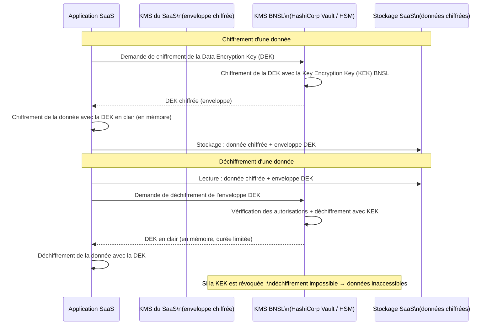

# BNSL-ARCH-SAAS-004 — Patron BYOK — Contrôle du chiffrement des données au repos dans les solutions SaaS

| Champ            | Valeur                                                  |
|------------------|---------------------------------------------------------|
| **Version**      | 1.0                                                     |
| **Statut**       | Approuvé                                                |
| **Propriétaire** | Direction Cybersécurité — Cryptographie et Protection des données — BNSL |
| **Date de révision** | 2025-12-01                                          |
| **Domaine**      | Chiffrement, BYOK, Gestion des clés — SaaS              |

---

## 1. Objectif et portée

Ce document définit les **exigences et le patron d'implémentation du modèle Bring Your Own Key (BYOK)** pour les solutions SaaS traitant des données confidentielles ou restreintes de la Banque Nordique du Saint-Laurent (BNSL).

Il s'applique à tout SaaS stockant, traitant ou transmettant des données classifiées **Confidentiel** ou **Restreint** au sens du cadre de classification des données BNSL (BNSL-CLASS-DATA-001). Il complète le volet chiffrement mentionné dans BNSL-ARCH-SAAS-005 (chiffrement en transit) en se concentrant spécifiquement sur le **chiffrement au repos** et la maîtrise des clés de chiffrement.

---

## 2. Contexte et enjeu

### 2.1 Pourquoi le chiffrement natif du fournisseur est insuffisant

La majorité des fournisseurs SaaS proposent un chiffrement au repos par défaut, géré par leurs propres systèmes de gestion de clés (provider-managed keys). Bien que ce chiffrement protège contre les accès physiques non autorisés aux supports de stockage, il présente des limites significatives dans un contexte bancaire réglementé :

- **Compromission du fournisseur** : si un acteur malveillant obtient un accès à l'environnement de gestion des clés du fournisseur, il peut déchiffrer toutes les données des locataires.
- **Obligation de révocation** : en cas d'incident impliquant le fournisseur (fuite de données, compromission d'un administrateur), la BNSL ne peut pas révoquer l'accès aux données de façon autonome si les clés sont gérées par le fournisseur.
- **Conformité réglementaire** : OSFI B-10 impose à la BNSL de maintenir un contrôle effectif sur ses données critiques même lorsqu'elles sont hébergées chez un tiers. La maîtrise des clés de chiffrement est un moyen de démontrer ce contrôle.
- **Exigences d'audit** : certains régulateurs (et la BNSL elle-même) exigent la capacité de prouver que les données sont inaccessibles au fournisseur sans l'accord de la BNSL.

### 2.2 Scénario de révocation d'urgence

Le BYOK permet à la BNSL de **révoquer l'accès à ses données chez un fournisseur SaaS** en désactivant ou supprimant la clé dans son propre KMS, sans dépendre du fournisseur pour cette action. Ce scénario est pertinent en cas de :
- Résiliation de contrat avec litige
- Compromission avérée de l'environnement du fournisseur
- Injonction réglementaire ou judiciaire d'isolation des données

---

## 3. Modèles de chiffrement — Définitions et applicabilité

| Modèle                          | Description                                                                                              | Données applicables (BNSL) |
|---------------------------------|----------------------------------------------------------------------------------------------------------|-----------------------------|
| **Provider-Managed Keys (PMK)** | Les clés sont générées et gérées entièrement par le fournisseur SaaS dans son propre KMS.               | Publiques, Internes         |
| **Customer-Managed Keys (CMK)** | Les clés sont générées par le client dans le KMS du fournisseur cloud (ex. : AWS KMS, Azure Key Vault). Le client contrôle la clé mais dans l'infrastructure du fournisseur. | Confidentielles             |
| **Bring Your Own Key (BYOK)**   | La clé de chiffrement est générée dans le HSM de la BNSL, puis importée dans l'environnement du fournisseur pour chiffrer les données locataires. La BNSL conserve la copie maître de la clé. | **Restreintes**             |
| **BYOE / HYOK**                 | La BNSL réalise elle-même le chiffrement avant l'envoi des données au SaaS. Les données ne sont jamais en clair dans l'environnement du fournisseur. Le SaaS traite des données opaques. | Cas extrêmes — usage très limité, fonctionnalités SaaS dégradées |

---

## 4. Infrastructure de gestion des clés BNSL

### 4.1 KMS interne — HashiCorp Vault Enterprise

**HashiCorp Vault Enterprise** est le KMS interne de référence de la BNSL pour la gestion des secrets et des clés cryptographiques. Il est utilisé pour :
- La génération et le stockage des clés de données
- L'intégration avec les processus de chiffrement applicatifs
- L'audit complet des opérations sur les clés (qui a demandé quoi, quand)

### 4.2 Intégration Azure Key Vault

Pour les workloads hébergés sur Azure, **Azure Key Vault** (mode HSM managé — Azure Dedicated HSM) est utilisé en complément de HashiCorp Vault. Les deux systèmes sont synchronisés pour les clés partagées entre les workloads Azure et les systèmes on-premises.

### 4.3 HSM physique — Thales Luna Network HSM

Les **clés racines** (root keys, Key Encryption Keys — KEK) sont exclusivement stockées dans un **HSM physique Thales Luna Network HSM**, déployé dans les centres de données primaire et secondaire de la BNSL. Ces clés ne quittent jamais le HSM en clair. Toute opération cryptographique impliquant une clé racine est réalisée à l'intérieur du HSM.

---

## 5. Patron BYOK avec un SaaS tiers

Le patron BYOK implique une dépendance entre le SaaS et le KMS de la BNSL pour chaque opération de déchiffrement. Voici comment ce patron est implémenté selon les principaux fournisseurs :

| Fournisseur SaaS / Cloud | Mécanisme BYOK               | Notes                                               |
|--------------------------|------------------------------|-----------------------------------------------------|
| **Salesforce**           | Salesforce Shield Platform Encryption + BYOK | La clé BNSL est importée dans Salesforce Key Management Service |
| **Microsoft 365 / Azure**| Microsoft Customer Key (M365) / Azure CMK | Intégration via Azure Key Vault géré par BNSL       |
| **AWS**                  | AWS KMS External Key Store (XKS) | Le KMS AWS appelle le KMS BNSL (HashiCorp Vault) pour chaque opération de chiffrement |
| **Workday**              | Workday Tenant Data Encryption (TDE) + clé client | Support BYOK partiel — évaluation en cours          |
| **ServiceNow**           | Customer-Managed Encryption Keys | Intégration via HSM ou KMS tiers                   |

### 5.1 Flux de chiffrement/déchiffrement BYOK

---

## 6. Évaluation BYOK lors de la sélection d'un SaaS

Lors de l'évaluation d'un SaaS traitant des données Restreintes, les questions suivantes sont obligatoires :

- [ ] Le SaaS supporte-t-il nativement le BYOK ? Si oui, via quel mécanisme ?
- [ ] À quel niveau le chiffrement est-il appliqué (base de données entière, tablespace, champ individuel, fichier) ?
- [ ] Les champs chiffrés sont-ils indexables ou recherchables ? (Attention : le chiffrement côté serveur avec BYOK rend souvent les champs non indexables)
- [ ] Quel est l'impact sur les performances (latence ajoutée par les appels au KMS BNSL lors de chaque opération de lecture/écriture) ?
- [ ] Le SaaS peut-il fonctionner en mode dégradé si le KMS BNSL est temporairement indisponible ? Quelle est la politique de mise en cache des clés déchiffrées ?
- [ ] Le fournisseur peut-il démontrer qu'il n'a aucun accès aux données en clair lorsque BYOK est activé ?
- [ ] Les backups du SaaS sont-ils également chiffrés avec la clé BNSL ?

---

## 7. Rotation et révocation des clés

### 7.1 Rotation planifiée

| Type de clé                | Fréquence de rotation | Responsable              |
|----------------------------|-----------------------|--------------------------|
| Data Encryption Key (DEK)  | Annuelle ou lors d'un incident | Équipe Cryptographie BNSL + fournisseur SaaS |
| Key Encryption Key (KEK)   | Tous les 2 ans        | Équipe Cryptographie BNSL (opération HSM)    |
| Clé racine HSM             | Tous les 5 ans        | Comité de gestion des clés BNSL             |

La rotation d'une DEK dans un SaaS implique un processus de re-chiffrement des données en place (re-keying). L'impact opérationnel (dégradation de performance temporaire, fenêtre de maintenance) doit être planifié avec le fournisseur.

### 7.2 Révocation d'urgence

En cas d'incident (compromission avérée ou suspectée de l'environnement SaaS, résiliation d'urgence) :
1. L'équipe Cyber Opérations BNSL émet un ordre de révocation vers l'équipe Cryptographie
2. La KEK est désactivée dans HashiCorp Vault et le HSM Thales (opération réversible — la clé est suspendue, pas supprimée)
3. Le SaaS ne peut plus déchiffrer aucune donnée — l'accès aux données devient impossible pour le fournisseur et ses utilisateurs
4. Une restauration est possible si l'incident est résolu et après approbation du CISO BNSL
5. La suppression définitive de la clé (destruction irréversible des données) ne peut être autorisée que par le CISO et le Directeur Juridique

---

## 8. Limites et risques connus

- **Le BYOK ne protège pas contre un accès applicatif malveillant** : si le fournisseur SaaS dispose d'un accès au niveau applicatif (ex. : administrateur SaaS qui peut lire les données déchiffrées via l'interface), le BYOK ne protège pas contre cet accès. La gouvernance des accès administrateurs fournisseurs (voir BNSL-SEC-PAM-001) est complémentaire.
- **Distinction chiffrement au repos / en transit / en usage** : le BYOK couvre le chiffrement **au repos** uniquement. Le chiffrement en transit est couvert par BNSL-ARCH-SAAS-005. Le chiffrement en usage (Confidential Computing) n'est pas encore déployé à la BNSL.
- **Dépendance opérationnelle au KMS BNSL** : si le KMS BNSL est indisponible, les données BYOK sont inaccessibles dans le SaaS. La haute disponibilité du KMS est critique. La stratégie HA/DR du KMS BNSL est documentée dans BNSL-SEC-KMS-001.
- **Impact fonctionnel** : certaines fonctionnalités des SaaS (recherche full-text, tri, rapports analytiques) peuvent être dégradées ou indisponibles sur les champs chiffrés avec BYOK.

---

## 9. Gestion des clés en contexte de reprise après sinistre

> ⚠️ **TODO** : Les procédures de gestion des clés BYOK dans un contexte de reprise après sinistre (DR) — incluant la disponibilité du KMS BNSL depuis le site de secours, les délais de recovery des clés, et les scénarios de perte du HSM primaire — sont en cours de développement conjointement avec l'équipe Continuité des Affaires. Ce volet sera documenté dans un addendum à ce guide. Contacter l'équipe Cryptographie BNSL pour les projets ayant des exigences de RTO/RPO spécifiques.

---

## Références

### Documents BNSL connexes
- `BNSL-ARCH-SAAS-001` — Standard IAM (gestion des comptes de service et des secrets)
- `BNSL-ARCH-SAAS-005` — Guide de réseautique (chiffrement en transit)
- `BNSL-CLASS-DATA-001` — Cadre de classification des données BNSL
- `BNSL-SEC-KMS-001` — Architecture et gouvernance du KMS BNSL
- `BNSL-SEC-PAM-001` — Gouvernance des accès privilégiés (non encore publié)

### Sources externes et réglementaires
- OSFI Ligne directrice B-10 — Risque lié aux tiers, contrôle des données externalisées
- NIST SP 800-57 — Recommendation for Key Management
- NIST SP 800-111 — Guide to Storage Encryption Technologies
- HashiCorp Vault Enterprise — Documentation Transit Secrets Engine et BYOK
- Salesforce Shield Platform Encryption — Guide d'architecture
- AWS KMS External Key Store (XKS) — Documentation officielle AWS
- Microsoft Customer Key (M365) — Documentation officielle Microsoft
- Thales Luna Network HSM — Documentation technique
