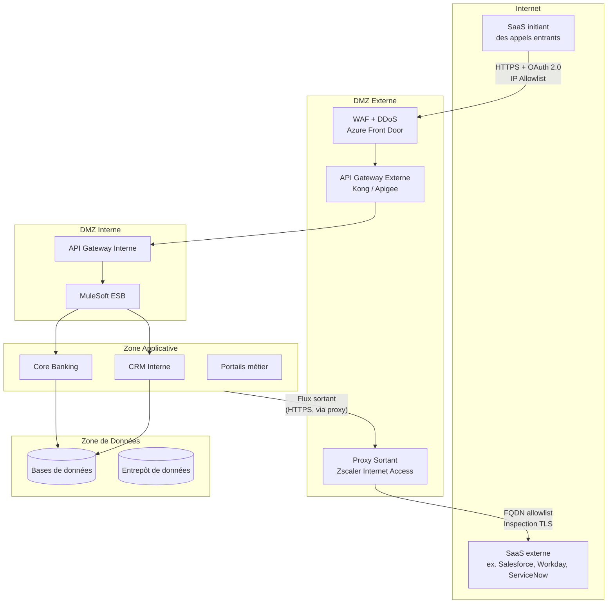

# BNSL-ARCH-SAAS-005 — Guide de réseautique et de segmentation réseau pour les flux d'intégration SaaS

| Champ            | Valeur                                                       |
|------------------|--------------------------------------------------------------|
| **Version**      | 1.1                                                          |
| **Statut**       | Approuvé                                                     |
| **Propriétaire** | Direction Infrastructure et Réseaux — Architecture BNSL     |
| **Date de révision** | 2026-01-10                                               |
| **Domaine**      | Réseautique, Segmentation, Sécurité périmétrique — SaaS      |

---

## 1. Objectif et portée

Ce guide définit les **patrons réseau approuvés** pour les flux d'intégration entre les systèmes internes de la Banque Nordique du Saint-Laurent (BNSL) et les solutions SaaS externes. Il garantit la **segmentation** des zones réseau, la **traçabilité** des flux et la **conformité** aux politiques de sécurité réseau de la BNSL.

Il s'applique à tout projet d'adoption de SaaS nécessitant des flux réseau entre les systèmes BNSL et un fournisseur tiers hébergé sur Internet ou dans un nuage public. Les équipes d'architecture de solution doivent consulter ce guide dès la phase d'évaluation d'un nouveau SaaS.

Ce guide doit être lu conjointement avec :
- **BNSL-ARCH-SAAS-003** — pour les règles de sécurité des flux entrants via l'API Gateway
- **BNSL-ARCH-SAAS-002** — pour les exigences de journalisation des flux réseau

---

## 2. Topologie réseau de référence BNSL

### 2.1 Description des zones réseau

La BNSL opère une architecture réseau segmentée en zones de sécurité distinctes, conformément au principe de défense en profondeur. La BNSL est également en cours d'adoption d'une architecture **Zero Trust**, dont les principes sont progressivement intégrés dans les nouvelles initiatives (authentification de chaque flux, vérification continue, moindre privilège réseau).

| Zone réseau           | Description                                                                    | Flux sortants vers Internet |
|-----------------------|--------------------------------------------------------------------------------|-----------------------------|
| **Internet**          | Zone non contrôlée — héberge les SaaS externes et les partenaires              | S.O.                        |
| **DMZ Externe**       | Zone de transit exposée à Internet — héberge WAF, API Gateway externe, Load Balancers | Non (flux entrant uniquement) |
| **DMZ Interne**       | Zone de transit entre l'externe et l'interne — MuleSoft ESB, connecteurs d'intégration | Non                    |
| **Zone Applicative**  | Serveurs d'application BNSL — core banking, CRM, portails employés             | Via proxy uniquement        |
| **Zone de Données**   | Bases de données, entrepôts de données, systèmes d'archivage                   | Interdit                    |
| **Réseau de Gestion** | Administration des équipements réseau et sécurité                              | Interdit                    |

### 2.2 Diagramme de la topologie réseau

---

## 3. Flux sortants — BNSL vers SaaS

### 3.1 Obligation de transit par le proxy sortant

**Tout flux Internet sortant** depuis la zone applicative, la zone DMZ interne ou le réseau de gestion BNSL **doit transiter par Zscaler Internet Access (ZIA)**, le proxy sortant sécurisé de la BNSL. Aucune sortie Internet directe n'est autorisée depuis ces zones.

Cela garantit :
- L'inspection de tout le trafic sortant (y compris TLS, sauf exceptions documentées)
- L'application des politiques de filtrage URL et catégories
- La journalisation de tous les flux sortants à des fins de traçabilité et d'audit

### 3.2 FQDN Allowlisting

Pour les SaaS cloud natifs dont les adresses IP peuvent changer fréquemment (elastic IP, anycast), la règle de pare-feu doit être basée sur le **FQDN (nom de domaine pleinement qualifié)** plutôt que sur l'adresse IP :

- Exemple correct : `*.salesforce.com`, `login.microsoftonline.com`
- Exemple incorrect : `52.x.x.x/24` (plage IP pouvant être réaffectée)

Les FQDN autorisés sont enregistrés dans le registre des dépendances réseau SaaS et font l'objet d'une revue annuelle.

### 3.3 Inspection TLS

L'inspection TLS est **activée par défaut** sur Zscaler pour tous les flux sortants BNSL. Des exceptions sont documentées et approuvées pour :
- Les applications utilisant le **certificate pinning** (l'inspection TLS casserait la validation)
- Les flux contenant des données hautement sensibles dont l'inspection est contractuellement interdite
- Les communications avec des services de paiement (PCI-DSS scope)

Toute exception à l'inspection TLS doit être approuvée par l'Architecture de Sécurité et documentée dans le registre des exceptions réseau.

---

## 4. Flux entrants — SaaS vers BNSL

### 4.1 Point d'entrée unique obligatoire

Tout flux entrant initié par un SaaS vers les systèmes BNSL **doit arriver sur l'API Gateway en DMZ Externe** (voir BNSL-ARCH-SAAS-003 pour les détails de sécurité de ce composant). Aucune ouverture de port entrant n'est autorisée :
- Directement vers la zone applicative
- Directement vers la zone de données
- Directement vers la DMZ interne (sans passer par la DMZ externe)

### 4.2 Cas d'exception — VPN site-à-site et Private Link

Pour les SaaS nécessitant une connectivité privée (flux de volume élevé, données très sensibles, SaaS hébergé sur Azure ou AWS), des alternatives à l'exposition via l'API Gateway public peuvent être approuvées :

**VPN site-à-site** : tunnel IPSec entre l'infrastructure du fournisseur SaaS et la BNSL. Réservé aux SaaS avec une infrastructure dédiée par tenant. Requis : documentation du modèle de sécurité côté fournisseur.

**Azure Private Link / AWS PrivateLink** : connectivité privée via le réseau de backbone du fournisseur cloud, sans transit par Internet. Ce patron est préféré au VPN pour les SaaS hébergés sur Azure ou AWS, car il élimine l'exposition publique et réduit la surface d'attaque.

Ces cas d'exception doivent être justifiés dans le dossier d'architecture et approuvés par l'équipe Infrastructure Réseau.

---

## 5. Connectivité privée — Private Link

Les conditions d'usage d'Azure Private Link ou AWS PrivateLink sont les suivantes :

| Critère                                   | Requis pour activer Private Link        |
|-------------------------------------------|-----------------------------------------|
| SaaS hébergé sur Azure ou AWS             | Obligatoire (condition préalable)       |
| Données classifiées Confidentiel/Restreint | Recommandé fortement                   |
| Volume de données élevé (> 10 GB/jour)    | Recommandé pour des raisons de coût/perf|
| Exigence de latence < 50ms                | Recommandé                              |
| Accord du fournisseur SaaS                | Obligatoire (feature payante chez certains fournisseurs) |

**Avantages** du Private Link :
- Le trafic ne transite pas par l'Internet public
- Réduction de la surface d'exposition DDoS
- Latence réduite et débit amélioré
- Simplification des règles de pare-feu (pas d'IP publiques)

---

## 6. Exigences de chiffrement en transit

| Protocole         | Statut                   | Notes                                           |
|-------------------|--------------------------|-------------------------------------------------|
| **TLS 1.3**       | Recommandé               | Performances améliorées, sécurité renforcée     |
| **TLS 1.2**       | Autorisé (minimum)       | Suites cryptographiques BNSL uniquement         |
| **TLS 1.1**       | **Interdit**             | Vulnérabilités connues (POODLE, BEAST)          |
| **TLS 1.0**       | **Interdit**             | Déprécié par NIST et PCI-DSS                   |
| **SSL 3.0 et antérieur** | **Interdit**      | Vulnérabilités critiques                        |

### 6.1 Suites cryptographiques acceptées (TLS 1.2)

- `TLS_ECDHE_RSA_WITH_AES_256_GCM_SHA384`
- `TLS_ECDHE_RSA_WITH_AES_128_GCM_SHA256`
- `TLS_ECDHE_ECDSA_WITH_AES_256_GCM_SHA384`

Les suites basées sur RC4, 3DES, ou utilisant des clés RSA inférieures à 2048 bits sont **interdites**.

---

## 7. Gestion des certificats

### 7.1 Certificats exposés par la BNSL

Les certificats des endpoints API Gateway BNSL sont émis par **DigiCert** (CA publique) pour les endpoints accessibles depuis Internet, et par la **PKI interne BNSL** pour les communications inter-zones internes.

### 7.2 Certificats des SaaS

Lors de la configuration d'un flux sortant ou entrant avec un SaaS, l'équipe d'intégration doit :
- Valider la chaîne de confiance du certificat du SaaS (CA reconnue, pas de certificat auto-signé)
- Vérifier l'inscription du certificat dans les journaux **Certificate Transparency** (CT Logs)
- Configurer des alertes sur l'expiration imminente (30 jours avant expiration) via l'outil de monitoring des certificats BNSL

### 7.3 Certificate Pinning

Le certificate pinning côté BNSL (fixer le fingerprint d'un certificat spécifique d'un SaaS) est **déconseillé** en raison du risque opérationnel lors du renouvellement du certificat par le fournisseur. Si le pinning est requis pour des raisons de sécurité exceptionnelles, une procédure de mise à jour du pin doit être documentée et testée.

---

## 8. Journalisation des flux réseau

Conformément aux exigences de BNSL-ARCH-SAAS-002, les flux réseau associés aux intégrations SaaS doivent être journalisés :

- **NSG Flow Logs** (Azure) ou équivalent AWS pour tous les flux traversant les zones réseau BNSL
- **Zscaler Access Logs** pour tous les flux sortants (FQDN, utilisateur ou système source, volume, verdict de sécurité)
- **API Gateway Access Logs** pour tous les appels entrants et sortants via le Gateway
- Ces logs doivent être corrélés avec les journaux applicatifs dans Splunk pour permettre la reconstruction complète d'un flux lors d'une investigation forensique

---

## 9. Patron réseau pour les agents IA SaaS

> ⚠️ **TODO** : Le patron réseau pour les agents IA SaaS accédant à des données internes BNSL — incluant les services LLM-as-a-service (ex. : Azure OpenAI Service, Anthropic API), les assistants IA intégrés dans les SaaS (ex. : Salesforce Einstein, Microsoft 365 Copilot) et les architectures RAG avec accès aux systèmes internes — est en cours d'élaboration par le groupe de travail IA de la BNSL. Les enjeux incluent notamment : la sortie de données potentiellement sensibles vers des modèles hébergés chez des tiers, la gestion des consentements, et la conformité à Loi 25. Les architectes de solution travaillant sur des projets IA doivent contacter l'équipe Architecture d'Entreprise avant de définir les flux réseau pour ces cas d'usage.

---

## Références

### Documents BNSL connexes
- `BNSL-ARCH-SAAS-002` — Guide de journalisation et d'observabilité (journalisation des flux réseau)
- `BNSL-ARCH-SAAS-003` — Guide d'intégration entrante via l'API Gateway BNSL
- `BNSL-ARCH-SAAS-004` — Patron BYOK (chiffrement au repos)
- `BNSL-NET-ZT-001` — Feuille de route Zero Trust BNSL
- `BNSL-NET-PKI-001` — Architecture PKI et gestion des certificats BNSL

### Sources externes et réglementaires
- OSFI Ligne directrice B-10 — Gestion des risques liés aux tiers et à la chaîne d'approvisionnement
- NIST SP 800-207 — Zero Trust Architecture
- RFC 8446 — TLS 1.3
- PCI-DSS v4.0 — Exigences de chiffrement en transit
- Zscaler Internet Access — Documentation technique
- Azure Private Link — Documentation Microsoft
- AWS PrivateLink — Documentation AWS
- Certificate Transparency (RFC 6962)
