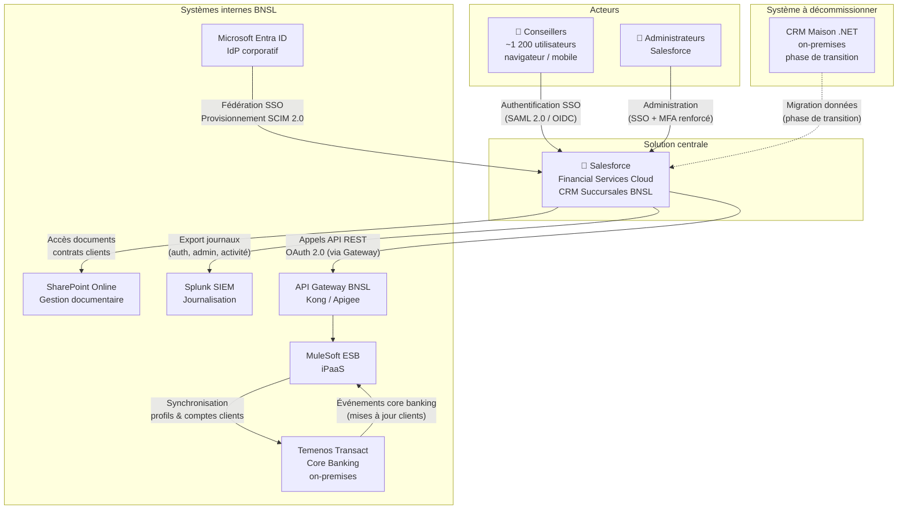
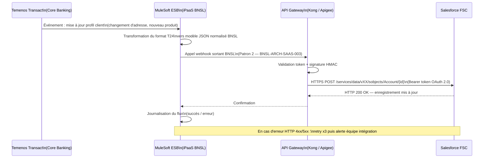

# BNSL-ARCH-SOL-2025-031 — Architecture de solution : CRM Succursales — Salesforce Financial Services Cloud

| Champ                     | Valeur                                                        |
|---------------------------|---------------------------------------------------------------|
| **Identifiant**           | BNSL-ARCH-SOL-2025-031                                        |
| **Titre**                 | Adoption de Salesforce Financial Services Cloud comme CRM centralisé du réseau de succursales |
| **Version**               | 0.1 — Ébauche initiale (générée par ASAI)                    |
| **Statut**                | En révision                                                   |
| **Architecte responsable**| [À compléter par l'architecte]                                |
| **Date de génération**    | 2026-01-20                                                    |
| **Domaine**               | Distribution / Relation client                                |

---

## 1. Résumé exécutif

La Banque Nordique du Saint-Laurent (BNSL) amorce le remplacement de son CRM maison — une application .NET hébergée on-premises en fin de vie — par **Salesforce Financial Services Cloud (FSC)**, une plateforme SaaS spécialisée pour le secteur financier. Cette initiative touchera environ **1 200 conseillers** du réseau de succursales répartis au Québec, en Ontario et en Alberta.

L'objectif principal est de doter les conseillers d'un outil de gestion de la relation client moderne, unifié et mobile, capable de s'intégrer nativement avec les systèmes structurants de la BNSL : le core banking Temenos Transact, l'annuaire Microsoft Entra ID et la plateforme documentaire SharePoint Online.

Les bénéfices attendus incluent l'amélioration de l'expérience conseiller, la consolidation des données clients (profils, comptes, opportunités) dans un référentiel unique, et la réduction des coûts de maintenance du CRM actuel. Les principaux enjeux d'architecture identifiés à ce stade sont : la stratégie d'intégration bidirectionnelle avec Temenos, la gouvernance des identités et des accès (IAM/SSO), la résidence canadienne des données clients dans Salesforce, la classification des données hébergées, et la définition du niveau de criticité et des exigences de résilience associées.

---

## 2. Contexte et objectifs

### 2.1 Contexte d'affaires

Le CRM actuel de la BNSL est une application .NET développée sur mesure, hébergée on-premises, qui accumule une dette technique significative. Elle ne supporte pas l'accès mobile, son intégration avec Temenos Transact est partielle et maintenue manuellement, et sa capacité d'évolution est limitée. Les conseillers en succursale expriment des difficultés à accéder à une vue unifiée du client.

Le projet vise à adopter Salesforce FSC, une solution SaaS reconnue dans le secteur bancaire, pour adresser ces lacunes dans le cadre de la stratégie de modernisation de la distribution de la BNSL.

### 2.2 Objectifs architecturaux

- **OA-01** : Fédérer l'authentification des conseillers dans Salesforce FSC via Entra ID (SSO), conformément à BNSL-ARCH-SAAS-001.
- **OA-02** : Synchroniser les données clients (profils, comptes, produits détenus) entre Temenos Transact et Salesforce FSC via un patron d'intégration gouverné, conforme à BNSL-ARCH-SAAS-003.
- **OA-03** : Garantir que les données personnelles des clients BNSL hébergées dans Salesforce FSC restent en territoire canadien, conformément aux obligations réglementaires (Loi 25, OSFI B-10).
- **OA-04** : Définir un niveau de criticité et des exigences de résilience (RTO/RPO) appropriées pour Salesforce FSC en tant que système de distribution front-office.
- **OA-05** : Établir un cadre de journalisation des accès et des actions dans Salesforce FSC, alimentant le SIEM Splunk de la BNSL (BNSL-ARCH-SAAS-002).

### 2.3 Hors-portée explicite

- La migration des données historiques du CRM actuel vers Salesforce FSC (fait l'objet d'un plan de migration distinct).
- L'intégration avec les systèmes de gestion de patrimoine ou d'investissement (hors périmètre de cette phase).
- Le déploiement de fonctionnalités Salesforce Einstein / IA générative (reporté à une phase ultérieure, en attente du cadre IA BNSL).
- L'accès client direct à Salesforce (le portail client reste sur la plateforme bancaire numérique BNSL existante).
- La gestion des licences et la négociation contractuelle avec Salesforce (responsabilité de la Direction des Achats).

---

## 3. Vue de contexte

---

## 4. Décisions d'architecture

---

### ADR-001 — Patron d'intégration avec Temenos Transact

**Contexte :**
Salesforce FSC doit afficher une vue enrichie du client intégrant les données issues de Temenos Transact (soldes, produits détenus, historique de transactions récent). Temenos est hébergé on-premises dans les centres de données BNSL. Les deux systèmes doivent rester cohérents en cas de modification d'un profil client.

**Options évaluées :**
1. Appel REST direct de Salesforce vers Temenos (API Temenos T24 Connect)
2. Intégration via MuleSoft ESB comme couche d'orchestration (Patron 3 — BNSL-ARCH-SAAS-003)
3. Synchronisation batch nightly via fichiers plats

**Décision :**
**Option 2 retenue** — Intégration via MuleSoft ESB, avec exposition d'une API REST sur l'API Gateway BNSL, consommée par Salesforce FSC (Patron 1 — appel synchrone REST/HTTPS, BNSL-ARCH-SAAS-003).

**Justification (alignement guides BNSL) :**
Conformément à BNSL-ARCH-SAAS-003, tout SaaS tiers accédant aux systèmes internes BNSL doit passer par l'API Gateway institutionnel. L'appel direct vers Temenos (option 1) est un patron explicitement interdit. MuleSoft permet la transformation des données Temenos (format propriétaire T24) vers un modèle normalisé JSON, la gestion des erreurs, et l'orchestration de plusieurs appels système si nécessaire.

Pour les mises à jour initiées dans Temenos (ex. : changement d'adresse en succursale via le core banking), un mécanisme de webhook sortant BNSL vers Salesforce (Patron 2 — BNSL-ARCH-SAAS-003) sera mis en place pour pousser les événements en near-real-time.

**Conséquences / risques :**
- Dépendance à la disponibilité de MuleSoft sur le chemin critique des conseillers.
- Latence ajoutée par la couche d'intégration (~50-150ms estimés) — à valider en tests de charge.
- Nécessité de définir la stratégie de gestion des conflits (Temenos vs Salesforce comme système maître pour chaque attribut client).

---

### ADR-002 — Stratégie IAM et SSO pour Salesforce FSC

**Contexte :**
1 200 conseillers et un nombre à préciser d'administrateurs doivent accéder à Salesforce FSC. La BNSL a comme politique d'éliminer les silos d'identité et d'imposer la fédération via Entra ID pour tous les SaaS (BNSL-ARCH-SAAS-001).

**Options évaluées :**
1. Comptes locaux Salesforce (identifiants Salesforce natifs)
2. SSO via Entra ID avec SAML 2.0
3. SSO via Entra ID avec OIDC

**Décision :**
**Option 2 retenue** — Fédération SSO via Microsoft Entra ID avec protocole **SAML 2.0** (protocole privilégié pour les SaaS d'entreprise matures selon BNSL-ARCH-SAAS-001). Le provisionnement des comptes sera automatisé via **SCIM 2.0**, piloté depuis Entra ID.

**Justification (alignement guides BNSL) :**
Conformément à BNSL-ARCH-SAAS-001, l'authentification locale (option 1) est interdite en production. Salesforce FSC supporte nativement SAML 2.0 et SCIM 2.0 avec Entra ID. Les données clients hébergées dans Salesforce étant classifiées Confidentiel (voir section 6.1), la politique MFA renforcée s'applique : Microsoft Authenticator (notification push) obligatoire pour les conseillers, FIDO2 recommandé pour les administrateurs Salesforce.

Le déprovisionnement automatique via SCIM doit garantir la désactivation du compte Salesforce dans un délai de **4 heures** après départ d'un employé, conformément à la matrice BNSL-ARCH-SAAS-001.

**Conséquences / risques :**
- Dépendance à la disponibilité d'Entra ID pour l'accès à Salesforce. Un compte break glass local doit être configuré pour les scénarios de panne IdP, conformément à la section 6 de BNSL-ARCH-SAAS-001.
- La configuration du connecteur SCIM Salesforce doit être testée exhaustivement (notamment les scénarios de désactivation et de changement de rôle).

---

### ADR-003 — Résidence des données clients dans Salesforce FSC

**Contexte :**
Les profils clients, données de comptes, et opportunités commerciales seront hébergés dans Salesforce FSC. Ces données incluent des renseignements personnels identifiables (RPI) de clients canadiens. La Loi 25 (Québec) et OSFI B-10 imposent des contraintes sur la localisation des données et sur le contrôle exercé par la BNSL sur ses données externalisées.

**Options évaluées :**
1. Instance Salesforce sur datacenter US (défaut Salesforce)
2. Instance Salesforce sur datacenter canadien (Salesforce Government Cloud / Canada region)
3. Chiffrement BYOK avec clé BNSL sur instance Salesforce standard

**Décision :**
**Option 2 + Option 3 combinées** — Instance Salesforce provisionnée sur la **région canadienne Salesforce** (disponible via Hyperforce Canada), avec activation du **chiffrement BYOK** via Salesforce Shield Platform Encryption, utilisant une clé gérée par le KMS BNSL (HashiCorp Vault), conformément à BNSL-ARCH-SAAS-004.

**Justification (alignement guides BNSL) :**
Conformément à BNSL-ARCH-SAAS-004, les données classifiées Confidentiel requièrent au minimum une clé gérée par le client (CMK). Compte tenu de la sensibilité des données clients bancaires, le patron BYOK est retenu. La résidence canadienne est non négociable au regard de Loi 25 et des engagements BNSL envers ses clients.

**Conséquences / risques :**
- Le BYOK avec Salesforce Shield a un impact sur les fonctionnalités : certains champs chiffrés ne sont pas indexables (limitation de la recherche Salesforce). Une analyse champ par champ est nécessaire.
- Coût supplémentaire de Salesforce Shield Platform Encryption — [À PRÉCISER avec Direction des Achats].
- Dépendance opérationnelle au KMS BNSL pour toute opération de déchiffrement (voir ADR sur résilience).

---

### ADR-004 — Niveau de criticité et exigences de résilience

**Contexte :**
Salesforce FSC sera utilisé par 1 200 conseillers en succursale pour des interactions directes avec les clients. Une indisponibilité prolongée affecte directement la capacité de la BNSL à servir ses clients et à réaliser des ventes.

**Options évaluées :**
1. Criticité Standard (RTO 24h, RPO 24h)
2. Criticité Important (RTO 4h, RPO 4h)
3. Criticité Critique (RTO 1h, RPO 15min)

**Décision :**
**Criticité Important** retenue provisoirement (RTO 4h, RPO 4h), avec réévaluation à l'issue de la phase pilote. Le classement Critique pourrait être retenu si l'analyse d'impact métier (BIA) confirme qu'une indisponibilité de Salesforce FSC bloque des processus irremplaçables (ex. : ouverture de compte, traitement de demandes de crédit).

**Justification :**
Les conseillers disposent de processus de repli (accès direct à Temenos, outils de prise de notes papier) réduisant l'impact immédiat d'une indisponibilité de Salesforce. Les données critiques de compte restent dans Temenos Transact. Un mode dégradé est défini (section 7.3).

**Conséquences / risques :**
- Le SLA Salesforce FSC (99,9% — ~8,7h/an de downtime toléré) est compatible avec un RTO de 4h mais laisse peu de marge. La BNSL doit négocier des clauses de notification d'incident < 15 minutes.
- La stratégie de chiffrement BYOK (ADR-003) crée une dépendance : si le KMS BNSL est indisponible, Salesforce FSC est inaccessible même si Salesforce est lui-même opérationnel. La HA du KMS est un prérequis critique.

---

## 5. Vue d'intégration

### 5.1 Carte des intégrations

| # | Source             | Cible               | Direction     | Patron d'intégration          | Fréquence         | Volume estimé       | Données échangées                              |
|---|--------------------|--------------------|---------------|-------------------------------|-------------------|---------------------|------------------------------------------------|
| 1 | Entra ID           | Salesforce FSC     | Unidirectionnel (EntraID → SF) | SCIM 2.0 (provisionnement)     | Événementiel (RH) | ~5 événements/heure | Comptes utilisateurs, groupes, attributs      |
| 2 | Temenos Transact   | Salesforce FSC     | Bidirectionnel | MuleSoft + API Gateway (Patrons 1 & 2) | Near-real-time + Batch nightly | [À PRÉCISER] | Profils clients, comptes, produits détenus    |
| 3 | Salesforce FSC     | Temenos Transact   | Unidirectionnel (SF → TEM) | Appel API REST via MuleSoft    | Temps réel (on-demand) | [À PRÉCISER] | Mises à jour profil conseiller (adresse, contact) |
| 4 | Salesforce FSC     | SharePoint Online  | Bidirectionnel | Connecteur natif Salesforce-SharePoint (OAuth 2.0) | À la demande      | [À PRÉCISER] | Documents clients (contrats, pièces justificatives) |
| 5 | Salesforce FSC     | Splunk SIEM        | Unidirectionnel (SF → Splunk) | Push webhook / API Export (BNSL-ARCH-SAAS-002) | Near-real-time    | [À PRÉCISER] | Journaux d'auth, d'admin, d'activité métier   |

### 5.2 Flux principal — Mise à jour d'un profil client dans Temenos → Salesforce FSC

---

## 6. Exigences de sécurité et de conformité

### 6.1 Classification des données traitées

| Type de donnée                        | Classification BNSL | Présence dans Salesforce FSC |
|---------------------------------------|---------------------|------------------------------|
| Nom, prénom, date de naissance client | Confidentiel        | Oui                          |
| Coordonnées (adresse, téléphone)      | Confidentiel        | Oui                          |
| Numéro de compte bancaire             | Confidentiel        | Oui (référence, pas solde)   |
| Soldes et historique de transactions  | Restreint           | Non — données Temenos uniquement (affichage à la demande via API, non stockées dans SF) |
| Opportunités commerciales (leads)     | Interne             | Oui                          |
| Notes de conseillers                  | Confidentiel        | Oui                          |
| Documents clients (contrats, KYC)     | Confidentiel        | Via SharePoint Online        |

> **Point critique** : les soldes et l'historique transactionnel complet ne doivent **pas** être stockés dans Salesforce FSC. Salesforce affichera ces données en lecture seule via un appel API temps réel vers Temenos, sans persistance dans Salesforce.

### 6.2 Exigences IAM

Conformément à **BNSL-ARCH-SAAS-001** :
- **SSO** : fédération SAML 2.0 via Entra ID — obligatoire (données Confidentiel)
- **MFA** : MFA renforcé anti-phishing (Microsoft Authenticator notification push) — obligatoire pour tous les conseillers ; FIDO2 recommandé pour les administrateurs Salesforce
- **Provisionnement** : SCIM 2.0 depuis Entra ID — obligatoire ; déprovisionnement en < 4h après départ
- **Comptes techniques** : compte de service dédié par intégration (MuleSoft, connecteur SharePoint) — stockage des secrets dans HashiCorp Vault, rotation tous les 90 jours
- **Revue des accès** : semestrielle (SaaS Important), via Entra ID Access Reviews
- **Comptes break glass** : 2 comptes locaux Salesforce configurés, identifiants en coffre physique, usage journalisé dans Splunk

### 6.3 Résidence des données

Conformément à **BNSL-ARCH-SAAS-004** et aux exigences réglementaires :
- **Région Salesforce** : Canada (Hyperforce Canada — Toronto/Montréal)
- **Chiffrement au repos** : Salesforce Shield Platform Encryption avec BYOK, clé KEK dans HashiCorp Vault BNSL
- **Sauvegardes Salesforce** : à contractualiser — les backups doivent rester en territoire canadien
- **Sous-traitance par Salesforce** : liste des sous-traitants de Salesforce accédant aux données BNSL à obtenir et approuver (obligation Loi 25)

### 6.4 Conformité réglementaire

| Cadre           | Impact identifié                                                                                   |
|-----------------|----------------------------------------------------------------------------------------------------|
| **OSFI B-10**   | Salesforce est un tiers critique — évaluation de risque tiers obligatoire avant go-live, droit d'audit à contractualiser |
| **Loi 25 (QC)** | Évaluation des facteurs relatifs à la vie privée (EFVP / PIA) obligatoire ; résidence canadienne des données exigée ; contrat de sous-traitance conforme |
| **PIPEDA**      | Consentement clients à l'utilisation de leurs données dans un SaaS tiers — vérifier si les conditions générales existantes couvrent ce cas |
| **FINTRAC**     | Les données de détection de blanchiment restent dans Temenos — Salesforce n'est pas dans le périmètre FINTRAC direct |

### 6.5 Points ouverts en sécurité

- [ ] Validation par le CISO de la stratégie BYOK et de la politique de révocation d'urgence
- [ ] Évaluation des sous-traitants Salesforce accédant aux données BNSL (Loi 25)
- [ ] Analyse d'impact du chiffrement Shield sur les fonctionnalités Salesforce FSC (champs non indexables)
- [ ] Validation de la conformité du connecteur SharePoint Online avec BNSL-ARCH-SAAS-003
- [ ] Revue des permissions administrateurs Salesforce (accès Salesforce Support inclus) — en attente de BNSL-SEC-PAM-001

---

## 7. Continuité et résilience

### 7.1 Niveau de criticité retenu

**Criticité : Important** (provisoire — réévaluation après BIA complète)

Justification : Salesforce FSC supporte les activités de vente et de service client en succursale, mais les transactions financières sont exécutées dans Temenos Transact. Une indisponibilité de Salesforce n'empêche pas la BNSL de traiter des transactions, mais dégrade significativement la productivité des conseillers.

### 7.2 Exigences RTO / RPO

| Paramètre | Valeur cible | Justification |
|-----------|-------------|---------------|
| **RTO**   | 4 heures    | Délai acceptable avant impact sévère sur les activités de succursale |
| **RPO**   | 4 heures    | Perte de données acceptable (opportunités, notes de conseillers saisies dans la fenêtre) |

> [À PRÉCISER] : le BIA formel doit confirmer ou ajuster ces valeurs. Si des processus de crédit critique passent par Salesforce FSC, le RTO pourrait être ramené à 1h (Criticité).

### 7.3 Mode dégradé et procédures de repli

En cas d'indisponibilité de Salesforce FSC :
1. **Accès direct Temenos** : les conseillers peuvent consulter les données clients directement dans Temenos Transact via le terminal de core banking.
2. **Prise de notes hors-ligne** : procédure papier ou SharePoint pour capturer les interactions clients pendant l'indisponibilité.
3. **Réconciliation** : les notes et opportunités saisies hors-ligne doivent être saisies dans Salesforce FSC dans les 2 heures suivant le rétablissement.
4. **Communication** : le responsable de succursale est notifié par SMS automatique (via la plateforme de notification BNSL) en cas d'indisponibilité > 30 minutes.

> **Cas critique BYOK** : si l'indisponibilité de Salesforce est causée par une indisponibilité du KMS BNSL (HashiCorp Vault), la procédure de repli KMS définie dans BNSL-SEC-KMS-001 doit être déclenchée en priorité.

### 7.4 Exigences contractuelles envers Salesforce

| Exigence contractuelle                    | Valeur cible                                      |
|-------------------------------------------|---------------------------------------------------|
| SLA de disponibilité                      | 99,9% mensuel minimum (préférence : 99,95%)       |
| Notification d'incident                   | < 15 minutes après détection                      |
| Rapport post-incident (RCA)               | Sous 5 jours ouvrables                            |
| Résidence des données (contractuelle)     | Canada uniquement — clause explicite au contrat   |
| Résidence des sauvegardes                 | Canada uniquement                                 |
| Droit d'audit BNSL                        | Annuel ou sur déclenchement d'incident            |
| Rétention native des journaux             | Minimum 90 jours dans Salesforce                  |
| Accès aux journaux sans surcoût           | Obligatoire (BNSL-ARCH-SAAS-002)                  |

---

## 8. Risques et points ouverts

| ID     | Description du risque                                                                                  | Probabilité | Impact | Mitigation proposée                                                                                 | Statut  |
|--------|--------------------------------------------------------------------------------------------------------|-------------|--------|------------------------------------------------------------------------------------------------------|---------|
| R-001  | **Concentration de risque Salesforce** : indisponibilité prolongée de Salesforce FSC affecte 1 200 conseillers simultanément | M           | H      | Mode dégradé documenté (7.3) ; SLA contractuel renforcé ; monitoring proactif (Splunk alertes)     | Ouvert  |
| R-002  | **Désynchronisation Temenos / Salesforce** : échec silencieux de l'intégration MuleSoft entraîne des données incohérentes présentées aux conseillers | M           | H      | Mécanisme de réconciliation batch nightly ; alertes Splunk sur erreurs d'intégration ; tableau de bord de monitoring MuleSoft | Ouvert  |
| R-003  | **Comptes orphelins** : délai de déprovisionnement SCIM insuffisant laisse des ex-employés actifs dans Salesforce | F           | H      | SCIM automatisé avec délai < 4h ; revue semestrielle des accès via Entra ID Access Reviews          | Ouvert  |
| R-004  | **Résidence des données** : Salesforce stocke des données dans des régions non-canadiennes (backups, logs, métadonnées) | M           | H      | Clause contractuelle explicite ; audit annuel de la résidence effective ; activation Hyperforce Canada | Ouvert  |
| R-005  | **Impact fonctionnel du BYOK** : le chiffrement Shield désactive des fonctionnalités Salesforce critiques pour les conseillers (recherche, tri, rapports) | M           | M      | Analyse champ par champ avant activation ; tests fonctionnels complets en environnement de qualification | Ouvert  |
| R-006  | **Dépassement de licences** : croissance du nombre d'utilisateurs (intégrateurs, partenaires, futurs projets) dépasse le volume de licences contractualisé | F           | M      | Gouvernance des licences confiée à la Direction des Achats ; alertes automatiques sur le taux d'utilisation | Ouvert  |
| R-007  | **Indisponibilité KMS BNSL → Salesforce inaccessible** : dépendance BYOK crée un point de défaillance unique sur le chemin d'accès à Salesforce | F           | H      | Architecture HA/DR du KMS BNSL (BNSL-SEC-KMS-001) comme prérequis bloquant avant go-live           | Ouvert  |

---

## 9. Feuille de route d'architecture

| Phase | Objectif                                      | Livrables clés                                                                                       | Prérequis                                                        | Durée estimée |
|-------|-----------------------------------------------|------------------------------------------------------------------------------------------------------|------------------------------------------------------------------|---------------|
| **Phase 1 — Fondations** | Mettre en place les fondations techniques : IAM, réseau, intégration de base | Configuration SSO SAML + SCIM Entra ID ↔ Salesforce ; provisionnement des comptes pilotes ; ouvertures réseau via Zscaler et API Gateway ; activation BYOK (Shield) en environnement de test | Décision Kong vs Apigee finalisée ; HA/DR KMS opérationnel ; contrat Salesforce signé avec clauses résidence | 3 mois |
| **Phase 2 — Intégration Temenos + Pilote** | Activer l'intégration Temenos via MuleSoft et déployer auprès d'un groupe pilote | Flux Temenos → Salesforce (profils, comptes) ; flux Salesforce → Temenos (mises à jour) ; déploiement pilote ~100 conseillers (2 succursales) ; activation journalisation Splunk ; tests de résilience | Phase 1 complète ; recette de l'intégration MuleSoft ; formation des conseillers pilotes | 4 mois |
| **Phase 3 — Déploiement étendu** | Déploiement à l'ensemble des 1 200 conseillers et décommissionnement du CRM actuel | Déploiement par vagues régionales (QC, ON, AB) ; migration des données historiques CRM actuel ; décommissionnement du CRM .NET ; documentation opérationnelle finale | Phase 2 validée ; plan de migration des données approuvé ; PIA finalisée et approuvée | 6 mois |

---

## 10. Références

### Guides BNSL utilisés

- `BNSL-ARCH-SAAS-001` — Standard IAM pour les solutions SaaS — Fédération, provisionnement et gouvernance des accès
- `BNSL-ARCH-SAAS-002` — Guide de journalisation et d'observabilité pour les solutions SaaS
- `BNSL-ARCH-SAAS-003` — Guide d'intégration entrante via l'API Gateway BNSL — Flux SaaS vers systèmes internes
- `BNSL-ARCH-SAAS-004` — Patron BYOK — Contrôle du chiffrement des données au repos dans les solutions SaaS
- `BNSL-ARCH-SAAS-005` — Guide de réseautique et de segmentation réseau pour les flux d'intégration SaaS

### Références externes

- Salesforce Financial Services Cloud — Documentation officielle et guides d'architecture
- Salesforce Shield Platform Encryption — Guide d'implémentation BYOK
- Salesforce Hyperforce — Architecture de résidence des données
- OSFI Ligne directrice B-10 — Gestion du risque lié aux tiers et à la chaîne d'approvisionnement technologique (révision 2023)
- Loi 25 (Québec) — Loi modernisant des dispositions législatives en matière de protection des renseignements personnels
- PIPEDA — Loi sur la protection des renseignements personnels et les documents électroniques
- MuleSoft Anypoint Platform — Documentation d'architecture

### Documents connexes à produire

- [ ] **PIA / EFVP** — Évaluation des facteurs relatifs à la vie privée pour Salesforce FSC (obligatoire Loi 25, avant go-live)
- [ ] **Évaluation de risque tiers** — Évaluation OSFI B-10 de Salesforce (à produire par la 2ème ligne de défense)
- [ ] **Plan de migration des données** — Migration du CRM .NET vers Salesforce FSC (Phase 3)
- [ ] **Plan de tests de résilience** — Tests de basculement en mode dégradé, tests de révocation d'urgence BYOK
- [ ] **Contrat de sous-traitance** — Clauses de résidence des données, droit d'audit, liste des sous-traitants (à valider par le juridique BNSL)
